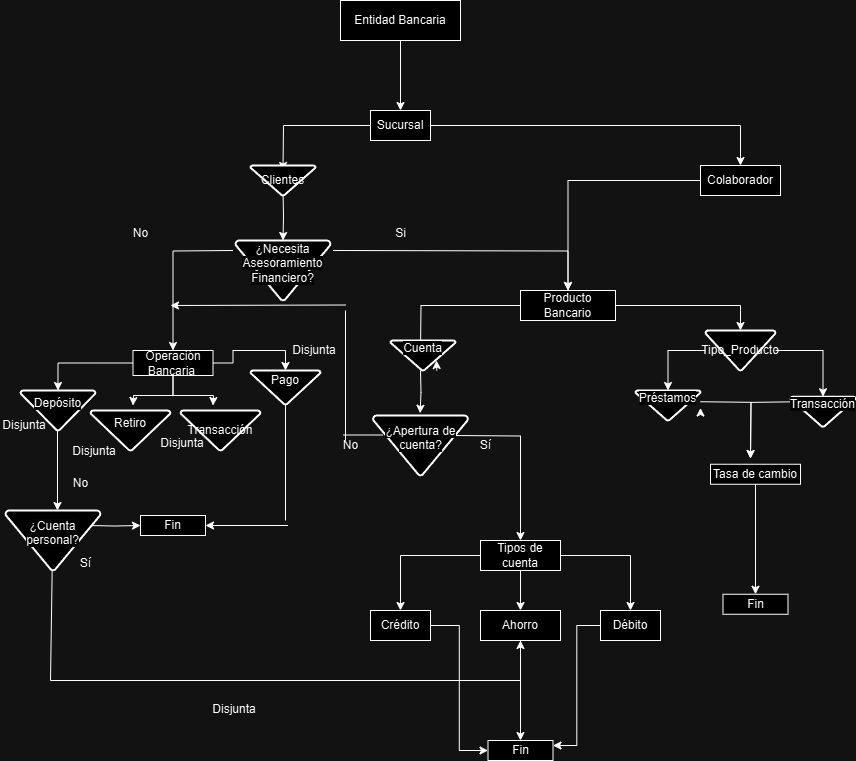
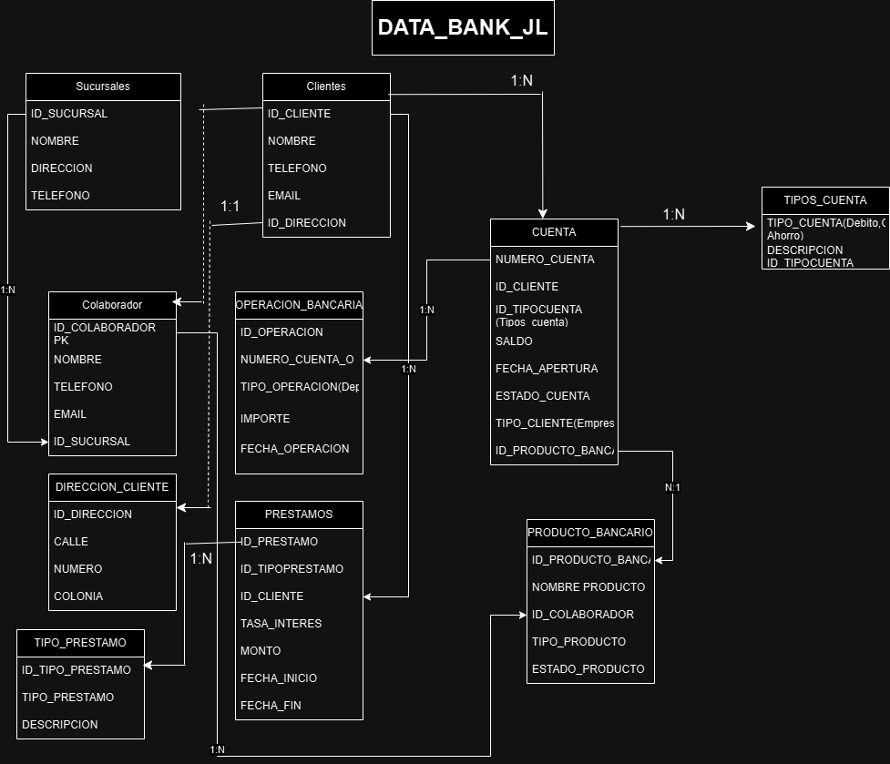

<h1 align="center" style="font-size: 2.5em; color: white;">
  Base de Datos Relacionales
</h1>
<h2 align="center" style="font-size: 2em; color: white;">
  Dra. Juanita Hernández López
</h2>
<div align="center">
  <h2 style="font-size: 1.8em; color: white; margin: 0;">
    Jorge Ramon Flores Portilla
  </h2>
  <h2 style="font-size: 1.8em; color: white; margin: 0;">
  </h2>
</div>
<h2 align="center" style="font-size: 2em; color: white;">
  Proyecto Final
</h2>


### Introducción

El proyecto surgió como una necesidad de modelar y estructurar la información de un banco ficticio llamado **BANCO BIRMANIA**, para facilitar su análisis, administración y operación. La idea principal fue diseñar una base de datos que reflejara las operaciones y relaciones entre sucursales, clientes, colaboradores, productos bancarios, transacciones y otras entidades que simulan el comportamiento del banco.

El principal reto fue llevar a cabo una abstracción adecuada que respetara las reglas de negocio y los principios de diseño de bases de datos garantizando la integridad de los mismos.

---
### Planteamiento del problema

* #### Proceso de Diseño

    - **Identificación de Entidades y Relaciones**:
        Se llevó a cabo un análisis para identificar las entidades principales y su interacción entre sí:
    - **Entidades Principales**: Sucursales, Clientes, Colaboradores, Productos Bancarios, Cuentas, Préstamos.
    - **Relaciones**: Se definieron las dependencias entre las entidades, como el vínculo entre clientes y cuentas, o colaboradores y productos bancarios.

* #### Integridad Referencial
    Uso de claves primarias y foráneas para asegurar consistencia entre entidades relacionadas:

    - **Claves Primarias:**
    - `ID_SUCURSAL` en **SUCURSALES**: Identifica de forma única cada sucursal.
    - `ID_CLIENTE` en **CLIENTES**: Distingue a cada cliente.
    - `ID_COLABORADOR` en **COLABORADOR**: Identifica a los colaboradores.
    - `NUMERO_CUENTA` en **CUENTA**: Identifica cada cuenta bancaria.
    - `ID_PRESTAMO` en **PRESTAMOS**: Identifica cada préstamo otorgado.
    - `ID_PRODUCTO_BANCARIO` en **PRODUCTO_BANCARIO**: Identifica productos financieros específicos.

    - **Claves Foráneas:**
    - **CUENTA** → `ID_CLIENTE`, `ID_TIPOCUENTA`, `ID_PRODUCTO_BANCARIO`: Relaciona cada cuenta con un cliente, tipo de cuenta y producto bancario.
    - **PRODUCTO_BANCARIO** → `ID_COLABORADOR`: Vincula productos financieros con el colaborador responsable.
    - **PRESTAMOS** → `ID_CLIENTE`, `ID_TIPOPRESTAMO`: Relaciona préstamos con clientes y tipos de préstamos.
    - **OPERACION_BANCARIA** → `NUMERO_CUENTA`: Relaciona transacciones con las cuentas correspondientes.

* #### Flexibilidad
    El diseño admite relaciones múltiples y diversas entre las entidades para reflejar situaciones reales:

    - **Cuentas compartidas:** Una cuenta puede estar asociada a múltiples clientes mediante relaciones uno-a-muchos (1:N) entre **CUENTA** y **CLIENTES**.
    - **Productos gestionados por colaboradores:** **COLABORADOR** está relacionado con **PRODUCTO_BANCARIO**, permitiendo asignar múltiples productos a un mismo colaborador.
    - **Préstamos y Clientes:** Un préstamo puede estar vinculado a varios clientes para situaciones de co-solicitud.
    - **Tipos de operaciones:** **OPERACION_BANCARIA** soporta múltiples transacciones como depósitos, retiros, pagos o transferencias, relacionadas directamente con **CUENTA**.

* #### Escalabilidad
    El modelo está diseñado para soportar el crecimiento del banco:

    - **Separación de entidades clave:** Tablas como **DIRECCION_CLIENTE**, **TIPO_PRESTAMO**, y **TIPOS_CUENTA** aseguran modularidad y limpieza.
    - **Relaciones bien definidas:** Esto facilita la expansión futura sin comprometer el rendimiento.

* ### Facilidad de Consulta
    El diseño permite realizar consultas comunes de manera eficiente:

    - **Relaciones bien definidas:** Las claves foráneas permiten realizar uniones claras y rápidas para consultas, como la suma de saldos por cliente o análisis de transacciones.
    - **Estructura modular:** Separar tablas como **TIPOS_CUENTA** y **TIPO_PRESTAMO** permite clasificar cuentas y préstamos para las consultas.

    ### Ejemplo de Consulta Optimizada

    Es fácil consultar el saldo total de cuentas por cliente, listar transacciones por fecha o analizar tasas de interés de préstamos. Por ejemplo:

    ```sql
    SELECT
        C.NOMBRE AS Cliente,
        SUM(CU.SALDO) AS SaldoTotal
    FROM
        CLIENTES C
    JOIN
        CUENTA CU ON C.ID_CLIENTE = CU.ID_CLIENTE
    GROUP BY
        C.NOMBRE
    ORDER BY
        SaldoTotal DESC;
    ```

    ---
### Descripción de entidades y relaciones

En el modelo diseñado, las relaciones principales incluyen:

- **Sucursales**: Cada sucursal tiene su propia administración, estando conectada con colaboradores, clientes y productos bancarios.

- **Clientes**: Los clientes pueden abrir cuentas, realizar transacciones y solicitar préstamos. Cada cliente tiene una dirección asociada para facilitar su identificación.

- **Colaboradores**: Los colaboradores gestionan los productos bancarios y actúan como responsables de las operaciones y servicios ofrecidos en las sucursales.

- **Productos Bancarios**: Incluyen préstamos y transacciones financieras.

- **Cuentas y Préstamos**: Los clientes pueden tener múltiples cuentas (de ahorro, crédito o débito) y solicitar préstamos (hipotecarios, automovilísticos o bancarios), cada uno con tasas de interés y plazos definidos.

- **Tipos de Cuenta**: Define los tipos de cuentas que ofrece el banco (débito, crédito o ahorro).

- **Dirección del Cliente**: Almacena información detallada de la dirección de cada cliente (calle, número, colonia), evitando redundancia en los datos.

- **Operación Bancaria**: Registra las transacciones realizadas por los clientes en sus cuentas, incluyendo depósitos, retiros, pagos y transferencias.

- **Tipo de Préstamo**: Clasifica los préstamos ofrecidos por el banco en categorías como hipotecario, automovilístico o bancario.

### Esquema E-R


### Esquema Relacional


### Retos
- Algunos de los retos fueron los siguientes:
    - **Integridad Referencial:**

        Diseñar un modelo que garantice la consistencia entre entidades relacionadas mediante el uso correcto de claves primarias y foráneas.
        Evitar errores de duplicación o eliminación accidental de datos relacionados.

    - **Normalización de Datos:**

        Asegurar que todas las tablas cumplan con las formas normales hasta la tercera (3FN) o más allá (BCNF), eliminando redundancias y asegurando la dependencia funcional entre atributos.
        Escalabilidad del Modelo:

    - **Consistencia:**

        Diseñar una base de datos que pueda manejar el crecimiento en la cantidad de sucursales, clientes, cuentas,transacciones sin comprometer el rendimiento (Y otras relaciones).
        Asegurar que el diseño permita futuras modificaciones, como la incorporación de nuevos productos o tipos de operaciones.

    - **Relaciones Complejas:**

        Gestionar correctamente relaciones como cuentas compartidas por múltiples clientes o préstamos asociados a varios solicitantes.
        Implementar adecuadamente claves compuestas y relaciones uno-a-muchos o muchos-a-muchos.

    - **Estandarización de Información:**

        Unificar la estructura de tablas redundantes, como en el caso de los tipos de préstamos y cuentas, para garantizar consistencia en la administración de datos.
        Implementar restricciones lógicas y físicas para asegurar que los datos cumplan con las reglas de negocio.

    - **Validación y Pruebas:**

        Probar la base de datos con datos simulados para garantizar que todas las relaciones funcionan correctamente y que las consultas devuelven los resultados esperados.
        Verificar que los triggers, vistas y funciones escalar y tabular trabajen como se espera en escenarios reales.


### Creación de Base de Datos
```sql
USE BIRMANIA;
GO

```sql
USE BIRMANIA;
GO

CREATE TABLE SUCURSALES (
    ID_SUCURSAL INT PRIMARY KEY,
    NOMBRE VARCHAR(100) NOT NULL,
    DIRECCION VARCHAR(200) NOT NULL,
    TELEFONO VARCHAR(15)
);

CREATE TABLE TIPOS_CUENTA (
    ID_TIPOCUENTA INT PRIMARY KEY,
    DESCRIPCION VARCHAR(200) NOT NULL,
    TIPO_CUENTA VARCHAR(10) NOT NULL CHECK (TIPO_CUENTA IN ('DEBITO', 'CREDITO', 'AHORRO'))
);

CREATE TABLE DIRECCION_CLIENTE (
    ID_DIRECCION INT PRIMARY KEY,
    CALLE VARCHAR(40) NOT NULL,
    NUMERO INT NOT NULL,
    COLONIA VARCHAR(40) NOT NULL
);

CREATE TABLE CLIENTES (
    ID_CLIENTE INT PRIMARY KEY,
    NOMBRE VARCHAR(100) NOT NULL,
    TELEFONO VARCHAR(100) NOT NULL,
    EMAIL VARCHAR(100) NOT NULL,
    ID_DIRECCION INT NOT NULL,
    FOREIGN KEY (ID_DIRECCION) REFERENCES DIRECCION_CLIENTE(ID_DIRECCION)
);

CREATE TABLE COLABORADOR (
    ID_COLABORADOR INT PRIMARY KEY,
    NOMBRE VARCHAR(100) NOT NULL,
    TELEFONO VARCHAR(100) NOT NULL,
    EMAIL VARCHAR(100) NOT NULL,
    ID_SUCURSAL INT NOT NULL,
    FOREIGN KEY (ID_SUCURSAL) REFERENCES SUCURSALES(ID_SUCURSAL)
);

CREATE TABLE PRODUCTO_BANCARIO (
    ID_PRODUCTO_BANCARIO INT PRIMARY KEY,
    NOMBRE_PRODUCTO VARCHAR(200) NOT NULL,
    TIPO_PRODUCTO VARCHAR(50) NOT NULL CHECK (TIPO_PRODUCTO IN ('PRESTAMOS', 'TRANSACCION')),
    ESTADO_PRODUCTO VARCHAR(10) NOT NULL CHECK (ESTADO_PRODUCTO IN ('ACTIVO', 'INACTIVO')),
    ID_COLABORADOR INT NOT NULL,
    FOREIGN KEY (ID_COLABORADOR) REFERENCES COLABORADOR(ID_COLABORADOR)
);

CREATE TABLE CUENTA (
    NUMERO_CUENTA INT PRIMARY KEY,
    ID_CLIENTE INT NOT NULL,
    ID_TIPOCUENTA INT NOT NULL,
    ID_PRODUCTO_BANCARIO INT NOT NULL,
    SALDO DECIMAL(15, 2) NOT NULL,
    FECHA_APERTURA DATE NOT NULL,
	TIPO_CLIENTE VARCHAR(50) NOT NULL CHECK (TIPO_CLIENTE IN ('EMPRESARIAL', 'PERSONAL')),
    ESTADO_CUENTA VARCHAR(10) NOT NULL CHECK (ESTADO_CUENTA IN ('ACTIVO', 'INACTIVO')),
    FOREIGN KEY (ID_CLIENTE) REFERENCES CLIENTES(ID_CLIENTE),
    FOREIGN KEY (ID_TIPOCUENTA) REFERENCES TIPOS_CUENTA(ID_TIPOCUENTA),
    FOREIGN KEY (ID_PRODUCTO_BANCARIO) REFERENCES PRODUCTO_BANCARIO(ID_PRODUCTO_BANCARIO)
);

CREATE TABLE OPERACION_BANCARIA (
    ID_OPERACION INT PRIMARY KEY,
    NUMERO_CUENTA INT NOT NULL,
    TIPO_OPERACION VARCHAR(50) NOT NULL CHECK (TIPO_OPERACION IN ('DEPOSITO', 'RETIRO', 'PAGO', 'TRANSACCION')),
    IMPORTE DECIMAL(10,2) NOT NULL,
    FECHA_OPERACION DATETIME NOT NULL,
    FOREIGN KEY (NUMERO_CUENTA) REFERENCES CUENTA(NUMERO_CUENTA)
);

CREATE TABLE TIPO_PRESTAMO (
    ID_TIPOPRESTAMO INT PRIMARY KEY, -- ID único del tipo de préstamo
    DESCRIPCION VARCHAR(200) NOT NULL, -- Descripción detallada del préstamo
    CATEGORIA VARCHAR(50) NOT NULL CHECK (CATEGORIA IN ('HIPOTECARIO', 'AUTOMOVILISTICO', 'BANCARIO')) -- Categoría del préstamo con valores permitidos
);
CREATE TABLE PRESTAMOS (
    ID_PRESTAMO INT PRIMARY KEY,
    ID_TIPOPRESTAMO INT NOT NULL,
    ID_CLIENTE INT NOT NULL,
    TASA_INTERES DECIMAL(5,2) NOT NULL,
    MONTO DECIMAL(10,2) NOT NULL,
    FECHA_INICIO DATE NOT NULL,
    FECHA_FIN DATE NOT NULL,
    FOREIGN KEY (ID_TIPOPRESTAMO) REFERENCES TIPO_PRESTAMO(ID_TIPOPRESTAMO),
    FOREIGN KEY (ID_CLIENTE) REFERENCES CLIENTES(ID_CLIENTE)
);
```
### Borrado de Tablas
```sql
-- Borrado de tablas BIRMANIA | En order de las dependencias de llaves foraneas

-- Primero eliminar las tablas que no tienen dependencias de otras tablas
DROP TABLE OPERACION_BANCARIA;
DROP TABLE PRESTAMOS;

-- Luego, eliminar las tablas que tienen dependencias de las tablas ya eliminadas
DROP TABLE CUENTA;
DROP TABLE PRODUCTO_BANCARIO;
DROP TABLE COLABORADOR;
DROP TABLE CLIENTES;

-- Continuar eliminando en orden, considerando las dependencias
DROP TABLE DIRECCION_CLIENTE;
DROP TABLE SUCURSALES;
DROP TABLE TIPOS_CUENTA;
DROP TABLE TIPO_PRESTAMO;
```
### Actualización de Tablas
```sql
--ALTER TABLE CLIENTES
ADD FECHA_NACIMIENTO DATE;

--ALTER TABLE PRESTAMOS
ALTER COLUMN TASA_INTERES NUMERIC(10,2);

-- Ejemplos de actualizaciones a Tablas

--ALTER TABLE SUCURSALES
DROP COLUMN TELEFONO;

--ALTER TABLE CUENTA
DROP CONSTRAINT CK__CUENTA__TIPO_CLI__571DF1D5;

--ALTER TABLE OPERACION_BANCARIA
ADD CONSTRAINT CK_IMPORTE_POSITIVO CHECK (IMPORTE >= 0);

--ALTER TABLE CUENTA
ADD CONSTRAINT CK_SALDO_POSITIVO CHECK (SALDO >= 0);

```
### Inserción de datos en Tablas
```sql
-- Insercion de registros en la tabla SURCURSALES
INSERT INTO [dbo].[SUCURSALES]
           ([ID_SUCURSAL]
           ,[NOMBRE]
           ,[DIRECCION]
           ,[TELEFONO])
     VALUES
(1, 'Sucursal Centro', 'Av. Principal 123, Centro', '555-123-4567'),
(2, 'Sucursal Norte', 'Calle Norte 456, Colonia Norte', '555-987-6543'),
(3, 'Sucursal Sur', 'Av. Sur 789, Colonia Sur', '555-567-8901'),
(4, 'Sucursal Oriente', 'Calle Oriente 1011, Colonia Oriente', '555-234-5678'),
(5, 'Sucursal Poniente', 'Av. Poniente 1213, Colonia Poniente', '555-890-1234'),
(6, 'Sucursal Reforma', 'Paseo de la Reforma 1415, Colonia Reforma', '555-345-6789'),
(7, 'Sucursal Insurgentes', 'Av. Insurgentes 1617, Colonia Insurgentes', '555-789-0123'),
(8, 'Sucursal Revolución', 'Calle Revolución 1819, Colonia Revolución', '555-456-7890'),
(9, 'Sucursal Constitución', 'Av. Constitución 2021, Colonia Constitución', '555-012-3456'),
(10, 'Sucursal Juárez', 'Calle Juárez 2223, Colonia Juárez', '555-678-9012'),
(11, 'Sucursal Hidalgo', 'Av. Hidalgo 2425, Colonia Hidalgo', '555-123-4567'),
(12, 'Sucursal Morelos', 'Calle Morelos 2627, Colonia Morelos', '555-987-6543'),
(13, 'Sucursal Allende', 'Av. Allende 2829, Colonia Allende', '555-567-8901'),
(14, 'Sucursal Aldama', 'Calle Aldama 3031, Colonia Aldama', '555-234-5678'),
(15, 'Sucursal Guerrero', 'Av. Guerrero 3233, Colonia Guerrero', '555-890-1234'),
(16, 'Sucursal Abasolo', 'Calle Abasolo 3435, Colonia Abasolo', '555-345-6789'),
(17, 'Sucursal Cuauhtémoc', 'Av. Cuauhtémoc 3637, Colonia Cuauhtémoc', '555-789-0123'),
(18, 'Sucursal Madero', 'Calle Madero 3839, Colonia Madero', '555-456-7890'),
(19, 'Sucursal Zaragoza', 'Av. Zaragoza 4041, Colonia Zaragoza', '555-012-3456'),
(20, 'Sucursal Carranza', 'Calle Carranza 4243, Colonia Carranza', '555-678-9012');

SELECT * FROM dbo.SUCURSALES;

-- Insercion de registros en la tabla TIPOS_CUENTA
INSERT INTO [dbo].[TIPOS_CUENTA]
           ([ID_TIPOCUENTA]
           ,[DESCRIPCION]
           ,[TIPO_CUENTA])
     VALUES
(1, 'Cuenta de Ahorro Básica', 'AHORRO'),
(2, 'Cuenta Corriente', 'DEBITO'),
(3, 'Tarjeta de Crédito Clásica', 'CREDITO'),
(4, 'Cuenta de Ahorro Premium', 'AHORRO'),
(5, 'Cuenta de Nómina', 'DEBITO'),
(6, 'Tarjeta de Crédito Gold', 'CREDITO'),
(7, 'Cuenta de Ahorro Infantil', 'AHORRO'),
(8, 'Cuenta Corriente para Jóvenes',  'DEBITO'),
(9, 'Tarjeta de Crédito Platinum', 'CREDITO'),
(10, 'Cuenta de Ahorro para Mayores',  'AHORRO'),
(11, 'Cuenta Corriente con Chequera',  'DEBITO'),
(12, 'Tarjeta de Crédito Black',  'CREDITO'),
(13, 'Cuenta de Ahorro en Dólares',  'AHORRO'),
(14, 'Cuenta Corriente en Euros',  'DEBITO'),
(15, 'Tarjeta de Débito Virtual',  'DEBITO'),
(16, 'Cuenta de Ahorro con Intereses',  'AHORRO'),
(17, 'Cuenta Corriente sin comisiones',  'DEBITO'),
(18, 'Tarjeta de Crédito con cashback',  'CREDITO'),
(19, 'Cuenta de Ahorro para Estudiantes',  'AHORRO'),
(20, 'Cuenta Corriente para Negocios',  'DEBITO');

SELECT * FROM dbo.TIPOS_CUENTA;

-- Insercion de registros en la tabla DIRECCION_CLIENTE

INSERT INTO [dbo].[DIRECCION_CLIENTE]
           ([ID_DIRECCION]
           ,[CALLE]
           ,[NUMERO]
           ,[COLONIA])
     VALUES
(1, 'Av. Principal', 1764, 'Colonia Madero'),
(2, 'Calle Carranza', 525, 'Colonia Guerrero'),
(3, 'Av. Guerrero', 1264, 'Colonia Zaragoza'),
(4, 'Av. Constitución', 408, 'Colonia Morelos'),
(5, 'Av. Zaragoza', 1350, 'Colonia Poniente'),
(6, 'Calle Abasolo', 739, 'Colonia Norte'),
(7, 'Calle Revolución', 1358, 'Colonia Hidalgo'),
(8, 'Calle Oriente', 928, 'Colonia Carranza'),
(9, 'Av. Sur', 1787, 'Colonia Revolución'),
(10, 'Av. Insurgentes', 863, 'Colonia Abasolo'),
(11, 'Calle Morelos', 1082, 'Colonia Norte'),
(12, 'Av. Hidalgo', 1813, 'Colonia Poniente'),
(13, 'Calle Aldama', 1502, 'Colonia Hidalgo'),
(14, 'Av. Principal', 1302, 'Colonia Norte'),
(15, 'Calle Revolución', 1616, 'Colonia Revolución'),
(16, 'Calle Norte', 129, 'Colonia Insurgentes'),
(17, 'Av. Zaragoza', 750, 'Colonia Madero'),
(18, 'Paseo de la Reforma', 1251, 'Colonia Juárez'),
(19, 'Av. Sur', 1883, 'Centro'),
(20, 'Calle Aldama', 1406, 'Colonia Carranza');

SELECT * FROM dbo.DIRECCION_CLIENTE;

-- Insercion de registros en la tabla CLIENTES

INSERT INTO [dbo].[CLIENTES]
           ([ID_CLIENTE]
           ,[NOMBRE]
           ,[TELEFONO]
           ,[EMAIL]
           ,[ID_DIRECCION])
     VALUES
(1, 'Juan Pérez', '555-1234', 'juan.perez@example.com', 11),
(2, 'María García', '555-5678', 'maria.garcia@example.com',12),
(3, 'Pedro Rodríguez', '555-9012', 'pedro.rodriguez@example.com', 13),
(4, 'Ana López', '555-3456', 'ana.lopez@example.com', 14),
(5, 'Luis Martínez', '555-7890', 'luis.martinez@example.com', 15),
(6, 'Sofía Hernández', '555-2345', 'sofia.hernandez@example.com', 20),
(7, 'Carlos González', '555-6789', 'carlos.gonzalez@example.com', 10),
(8, 'Laura Díaz', '555-0123', 'laura.diaz@example.com', 9),
(9, 'Jorge Sánchez', '555-4567', 'jorge.sanchez@example.com', 8),
(10, 'Isabel Ramírez', '555-8901', 'isabel.ramirez@example.com', 7),
(11, 'Fernando Torres', '555-3456', 'fernando.torres@example.com', 6),
(12, 'Marta Flores', '555-7890', 'marta.flores@example.com', 1),
(13, 'Miguel Vargas', '555-2345', 'miguel.vargas@example.com', 2),
(14, 'Carmen Reyes', '555-6789', 'carmen.reyes@example.com', 3),
(15, 'Javier Ortega', '555-0123', 'javier.ortega@example.com', 4),
(16, 'Raquel Morales', '555-4567', 'raquel.morales@example.com', 5),
(17, 'David Romero', '555-8901', 'david.romero@example.com', 16),
(18, 'Rosa Moreno', '555-3456', 'rosa.moreno@example.com', 17),
(19, 'Alberto Méndez', '555-7890', 'alberto.mendez@example.com', 18),
(20, 'Yolanda Domínguez', '555-2345', 'yolanda.dominguez@example.com', 19);

SELECT * FROM dbo.CLIENTES;

-- Insercion de registros en la tabla COLABORADOR
INSERT INTO [dbo].[COLABORADOR]
           ([ID_COLABORADOR]
           ,[NOMBRE]
           ,[TELEFONO]
           ,[EMAIL]
           ,[ID_SUCURSAL])
     VALUES
(1, 'Ana García', '555-1234', 'ana.garcia@example.com', 11),
(2, 'Luis Rodríguez', '555-5678', 'luis.rodriguez@example.com', 13),
(3, 'Sofía Martínez', '555-9012', 'sofia.martinez@example.com', 6),
(4, 'Carlos López', '555-3456', 'carlos.lopez@example.com', 5),
(5, 'Laura Hernández', '555-7890', 'laura.hernandez@example.com', 8),
(6, 'Jorge González', '555-2345', 'jorge.gonzalez@example.com', 20),
(7, 'Isabel Díaz', '555-6789', 'isabel.diaz@example.com', 12),
(8, 'Fernando Sánchez', '555-0123', 'fernando.sanchez@example.com', 19),
(9, 'Marta Ramírez', '555-4567', 'marta.ramirez@example.com', 7),
(10, 'Miguel Torres', '555-8901', 'miguel.torres@example.com', 17),
(11, 'Carmen Flores', '555-3456', 'carmen.flores@example.com', 18),
(12, 'Javier Vargas', '555-7890', 'javier.vargas@example.com', 14),
(13, 'Raquel Ortega', '555-2345', 'raquel.ortega@example.com', 2),
(14, 'David Morales', '555-6789', 'david.morales@example.com', 10),
(15, 'Rosa Romero', '555-0123', 'rosa.romero@example.com', 16),
(16, 'Alberto Moreno', '555-4567', 'alberto.moreno@example.com', 9),
(17, 'Yolanda Méndez', '555-8901', 'yolanda.mendez@example.com', 4),
(18, 'Juan Domínguez', '555-3456', 'juan.dominguez@example.com', 15),
(19, 'María Pérez', '555-7890', 'maria.perez@example.com', 1),
(20, 'Pedro García', '555-2345', 'pedro.garcia@example.com', 3);

SELECT * FROM dbo.COLABORADOR;

-- Insercion de registros en la tabla PRODUCTO_BANCARIO

INSERT INTO [dbo].[PRODUCTO_BANCARIO]
           ([ID_PRODUCTO_BANCARIO]
           ,[NOMBRE_PRODUCTO]
           ,[TIPO_PRODUCTO]
           ,[ESTADO_PRODUCTO]
           ,[ID_COLABORADOR])
     VALUES
(1, 'Préstamo Personal', 'PRESTAMOS', 'ACTIVO', 3),
(2, 'Tarjeta de Crédito Clásica', 'PRESTAMOS', 'ACTIVO', 1),
(3, 'Cuenta de Ahorro', 'TRANSACCION', 'ACTIVO', 15),
(4, 'Préstamo Hipotecario', 'PRESTAMOS', 'ACTIVO', 4),
(5, 'Transferencias Internacionales', 'TRANSACCION', 'ACTIVO', 9),
(6, 'Préstamo para Vehículo', 'PRESTAMOS', 'ACTIVO', 16),
(7, 'Pagos de Servicios', 'TRANSACCION', 'ACTIVO', 10),
(8, 'Préstamo para Estudios', 'PRESTAMOS', 'ACTIVO', 2),
(9, 'Inversiones en Fondos Mutuos', 'TRANSACCION', 'INACTIVO', 14),
(10, 'Préstamo para Consolidación de Deudas', 'PRESTAMOS', 'ACTIVO', 18),
(11, 'Compra de Divisas', 'TRANSACCION', 'ACTIVO', 17),
(12, 'Préstamo para Negocios', 'PRESTAMOS', 'ACTIVO', 7),
(13, 'Seguros de Vida', 'TRANSACCION', 'ACTIVO', 19),
(14, 'Préstamo para Vivienda', 'PRESTAMOS', 'INACTIVO', 12),
(15, 'Giros Nacionales', 'TRANSACCION', 'ACTIVO', 20),
(16, 'Tarjeta de Débito', 'TRANSACCION', 'ACTIVO', 8),
(17, 'Préstamo para Remodelación', 'PRESTAMOS', 'INACTIVO', 5),
(18, 'Apertura de Cuenta Corriente', 'TRANSACCION', 'ACTIVO', 6),
(19, 'Préstamo para Electrodomésticos', 'PRESTAMOS', 'ACTIVO', 13),
(20, 'Depósitos a Plazo Fijo', 'TRANSACCION', 'ACTIVO', 11);

SELECT * FROM dbo.PRODUCTO_BANCARIO;

-- Insercion de registros en la tabla CUENTA

INSERT INTO [dbo].[CUENTA]
           ([NUMERO_CUENTA]
           ,[ID_CLIENTE]
           ,[ID_TIPOCUENTA]
           ,[ID_PRODUCTO_BANCARIO]
           ,[SALDO]
           ,[FECHA_APERTURA]
           ,[TIPO_CLIENTE]
           ,[ESTADO_CUENTA])
     VALUES
(1235, 19, 17, 4, 235401.59, '2021-04-12', 'PERSONAL', 'ACTIVO'),
(1271, 17, 8, 4, 180357.39, '2023-01-13', 'PERSONAL', 'ACTIVO'),
(1736, 6, 19, 7, 189959.74, '2023-09-13', 'EMPRESARIAL', 'ACTIVO'),
(2057, 12, 10, 14, 433886.89, '2021-11-19', 'EMPRESARIAL', 'ACTIVO'),
(2673, 12, 2, 6, 137536.18, '2023-07-12', 'EMPRESARIAL', 'ACTIVO'),
(2737, 6, 15, 3, 487307.9, '2023-01-16', 'EMPRESARIAL', 'ACTIVO'),
(1329, 14, 18, 1, 187934.75, '2022-09-08', 'PERSONAL', 'ACTIVO'),
(1869, 18, 1, 13, 61532.83, '2023-04-30', 'PERSONAL', 'ACTIVO'),
(2507, 19, 5, 19, 115855.94, '2022-08-23', 'EMPRESARIAL', 'ACTIVO'),
(2233, 12, 2, 10, 66767.71, '2022-04-29', 'EMPRESARIAL', 'ACTIVO'),
(2423, 13, 13, 15, 228982.38, '2022-11-18', 'EMPRESARIAL', 'ACTIVO'),
(2250, 5, 15, 11, 416408.82, '2020-05-26', 'PERSONAL', 'ACTIVO'),
(1497, 15, 11, 2, 22160.86, '2022-07-05', 'PERSONAL', 'ACTIVO'),
(2449, 15, 7, 8, 95890.84, '2021-08-24', 'EMPRESARIAL', 'ACTIVO'),
(2306, 10, 10, 7, 104999.31, '2023-04-21', 'PERSONAL', 'ACTIVO'),
(1952, 6, 20, 10, 36928.36, '2022-08-01', 'EMPRESARIAL', 'ACTIVO'),
(1120, 12, 12, 17, 343154.8, '2020-11-08', 'PERSONAL', 'ACTIVO'),
(2910, 19, 2, 16, 231507.27, '2021-05-12', 'PERSONAL', 'ACTIVO'),
(2039, 13, 7, 18, 433194.59, '2023-06-12', 'EMPRESARIAL', 'ACTIVO'),
(2808, 3, 20, 11, 496777.46, '2023-12-24', 'EMPRESARIAL', 'ACTIVO');

SELECT * FROM dbo.CUENTA;

-- Insercion de registros en la tabla OPERACION_BANCARIA

INSERT INTO [dbo].[OPERACION_BANCARIA]
           ([ID_OPERACION]
           ,[NUMERO_CUENTA]
           ,[TIPO_OPERACION]
           ,[IMPORTE]
           ,[FECHA_OPERACION])
     VALUES
(745, 2673, 'TRANSACCION', 6443.0, '2023-08-04 00:00:00'),
(512, 1952, 'PAGO', 1199.82, '2023-05-26 00:00:00'),
(60, 1235, 'DEPOSITO', 2674.33, '2023-10-17 00:00:00'),
(667, 2673, 'TRANSACCION', 139.65, '2023-06-02 00:00:00'),
(276, 2910, 'DEPOSITO', 287.29, '2023-05-31 00:00:00'),
(409, 2233, 'TRANSACCION', 2360.96, '2023-03-05 00:00:00'),
(994, 1869, 'RETIRO', 623.97, '2023-12-21 00:00:00'),
(292, 1869, 'RETIRO', 8822.86, '2023-02-22 00:00:00'),
(462, 2306, 'PAGO', 1750.87, '2023-09-19 00:00:00'),
(106, 2910, 'TRANSACCION', 1284.08, '2023-10-21 00:00:00'),
(57, 1952, 'PAGO', 6785.48, '2023-03-09 00:00:00'),
(607, 2039, 'DEPOSITO', 574.25, '2023-11-08 00:00:00'),
(407, 2808, 'RETIRO', 3997.5, '2023-06-25 00:00:00'),
(150, 2423, 'TRANSACCION', 4971.59, '2023-07-13 00:00:00'),
(9, 2423, 'RETIRO', 6299.32, '2023-04-21 00:00:00'),
(974, 2449, 'TRANSACCION', 3277.99, '2023-09-13 00:00:00'),
(682, 1497, 'DEPOSITO', 4198.08, '2023-08-10 00:00:00'),
(42, 2039, 'TRANSACCION', 739.9, '2023-07-11 00:00:00'),
(810, 2306, 'DEPOSITO', 8153.33, '2023-07-28 00:00:00'),
(125, 1952, 'DEPOSITO', 5333.53, '2023-04-10 00:00:00');

SELECT * FROM dbo.OPERACION_BANCARIA;


-- Insercion de registros en la tabla TIPOS_PRESTAMO
INSERT INTO [dbo].[TIPO_PRESTAMO]
           ([ID_TIPOPRESTAMO]
           ,[DESCRIPCION]
           ,[CATEGORIA])
	 VALUES
(1, 'Préstamo Hipotecario a tasa fija', 'HIPOTECARIO'),
(2, 'Préstamo para Automóvil nuevo', 'AUTOMOVILISTICO'),
(3, 'Préstamo Personal para consolidación de deudas', 'BANCARIO'),
(4, 'Préstamo Hipotecario con tasa variable', 'HIPOTECARIO'),
(5, 'Préstamo para Automóvil usado', 'AUTOMOVILISTICO'),
(6, 'Préstamo para mejoras del hogar', 'BANCARIO'),
(7, 'Préstamo Hipotecario para construcción', 'HIPOTECARIO'),
(8, 'Préstamo para compra de motocicleta', 'AUTOMOVILISTICO'),
(9, 'Préstamo para estudios', 'BANCARIO'),
(10, 'Préstamo Hipotecario con garantía hipotecaria', 'HIPOTECARIO'),
(11, 'Préstamo para compra de embarcación', 'AUTOMOVILISTICO'),
(12, 'Préstamo para gastos médicos', 'BANCARIO'),
(13, 'Préstamo Hipotecario para refinanciamiento', 'HIPOTECARIO'),
(14, 'Leasing para vehículo empresarial', 'AUTOMOVILISTICO'),
(15, 'Préstamo para inicio de negocio', 'BANCARIO'),
(16, 'Préstamo Hipotecario para segunda vivienda', 'HIPOTECARIO'),
(17, 'Préstamo para compra de caravana', 'AUTOMOVILISTICO'),
(18, 'Préstamo para viajes', 'BANCARIO'),
(19, 'Préstamo Hipotecario inverso', 'HIPOTECARIO'),
(20, 'Préstamo para compra de vehículo clásico', 'AUTOMOVILISTICO');

SELECT * FROM dbo.TIPO_PRESTAMO;


-- Insercion de registros en la tabla PRESTAMOS

INSERT INTO [dbo].[PRESTAMOS]
           ([ID_PRESTAMO]
           ,[ID_TIPOPRESTAMO]
           ,[ID_CLIENTE]
           ,[TASA_INTERES]
           ,[MONTO]
           ,[FECHA_INICIO]
           ,[FECHA_FIN])
     VALUES
(1,  6,  8,  8.62, 166820.91, '2023-09-06', '2027-02-14'),
(2,  3, 10, 42.00, 451971.96, '2020-10-20', '2030-02-20'),
(3,  1, 10, 28.25, 431354.89, '2023-03-30', '2028-10-26'),
(4, 18,  3, 10.14,  28230.39, '2021-01-05', '2026-01-25'),
(5, 17, 14, 47.57, 394968.64, '2020-03-07', '2021-10-31'),
(6, 12,  2,  4.56, 175169.52, '2021-01-22', '2024-01-22'),
(7, 16, 18, 46.65, 320420.74, '2022-01-24', '2025-05-10'),
(8,  8, 14, 19.57, 147261.48, '2022-10-08', '2031-08-11'),
(9,  8, 15, 41.35, 480952.85, '2023-02-15', '2025-08-20'), 
(10, 19, 11, 28.88, 146929.00, '2020-03-04', '2027-03-21'),
(11,  1,  1, 47.82, 307871.98, '2020-01-13', '2021-01-07'),
(12,  4,  9, 23.58, 374376.33, '2020-12-09', '2029-04-08'),
(13, 12,  4,  7.24, 279789.81, '2022-08-27', '2024-02-25'),
(14, 13,  9, 10.10, 405595.11, '2022-11-24', '2031-07-10'),
(15, 12,  1, 23.08, 459900.49, '2021-10-07', '2025-09-23'),
(16,  2, 17, 17.41,  32117.80, '2022-09-18', '2023-07-16'),
(17,  4, 15, 36.55, 365185.80, '2023-07-22', '2026-02-11'),
(18,  8,  7, 25.55, 183948.62, '2023-02-09', '2024-11-06'),
(19,  5, 16, 41.42, 448007.08, '2020-05-01', '2023-09-03'),
(20, 14, 11,  4.80, 347324.59, '2021-11-29', '2028-10-28');

SELECT * FROM dbo.PRESTAMOS;

```
### Borrado de datos en Tablas
```sql

DELETE FROM [dbo].[SUCURSALES]
    WHERE NOMBRE='Sucursal Guerrero';

DELETE FROM [dbo].[TIPOS_CUENTA]
    WHERE ID_TIPOCUENTA = 10;

DELETE FROM [dbo].[TIPO_PRESTAMO]
    WHERE ID =19;

DELETE FROM [dbo].[CLIENTES]
    WHERE ID_CLIENTE = 16;

DELETE FROM PRODUCTO_BANCARIO WHERE ID_PRODUCTO_BANCARIO = 10;

DELETE FROM CUENTA WHERE NUMERO_CUENTA = 1235;

DELETE FROM CLIENTES WHERE ID_CLIENTE = 5;

DELETE FROM PRESTAMOS WHERE TASA_INTERES > 0.30;

DELETE FROM OPERACION_BANCARIA WHERE TIPO_OPERACION = 'DEPOSITO' AND IMPORTE < 1000.00;
-- Eliminar cuentas inactivas con saldo 0 que pertenecen a clientes que tienen más de una cuenta
DELETE CUENTA
WHERE ESTADO_CUENTA = 'INACTIVO'
  AND SALDO = 0
  AND ID_CLIENTE IN (SELECT ID_CLIENTE FROM CUENTA GROUP BY ID_CLIENTE HAVING COUNT(*) > 1);

-- Eliminar colaboradores que no han creado ningún producto bancario y que trabajan en una sucursal con menos de 5 colaboradores
DELETE FROM COLABORADOR
WHERE ID_COLABORADOR NOT IN (SELECT ID_COLABORADOR FROM PRODUCTO_BANCARIO)
  AND ID_SUCURSAL IN (SELECT ID_SUCURSAL FROM COLABORADOR GROUP BY ID_SUCURSAL HAVING COUNT(*) < 5);

-- Eliminar tipos de cuenta que no están siendo utilizados por ningún cliente y que son de tipo 'AHORRO'
DELETE FROM TIPOS_CUENTA
WHERE ID_TIPOCUENTA NOT IN (SELECT ID_TIPOCUENTA FROM CUENTA)
  AND TIPO_CUENTA = 'AHORRO';

--Configuracion de una tabla usando ON DELETE CASCADE
CREATE TABLE CUENTA (
    NUMERO_CUENTA INT PRIMARY KEY,
    ID_CLIENTE INT NOT NULL,
    FOREIGN KEY (ID_CLIENTE) REFERENCES CLIENTES(ID_CLIENTE) ON DELETE CASCADE
);
ALTER TABLE CUENTA
DROP CONSTRAINT FK_CUENTA_CLIENTE;

--Si nuestra tabla no esta configurada para eliminar relaciones en cascada, podemos realizar lo siguiente:

ALTER TABLE CUENTA
DROP CONSTRAINT FK_CUENTA_CLIENTE; --Nombre de la llave foranea de Cuenta
```
### Actualización de datos en Tablas
```sql
-- Actualizar el nombre de la sucursal con ID_SUCURSAL = 1
UPDATE SUCURSALES SET NOMBRE = 'Sucursal Centro Histórico' WHERE ID_SUCURSAL = 1;

-- Actualizar la dirección y el teléfono de la sucursal con ID_SUCURSAL = 5
UPDATE SUCURSALES SET DIRECCION = 'Av. Occidental 1213, Col. Poniente', TELEFONO = '555-890-5555' WHERE ID_SUCURSAL = 5;

-- Desactivar el tipo de cuenta con ID_TIPOCUENTA = 3
UPDATE TIPOS_CUENTA SET TIPO_CUENTA = 'INACTIVO' WHERE ID_TIPOCUENTA = 3;

-- Actualizar la descripción del tipo de préstamo con ID_TIPOPRESTAMO = 10
UPDATE TIPO_PRESTAMO SET DESCRIPCION = 'Préstamo con Garantía Hipotecaria' WHERE ID_TIPOPRESTAMO = 10;

-- Actualizar la calle y el número de la dirección del cliente con ID_CLIENTE = 15
UPDATE DIRECCION_CLIENTE SET CALLE = 'Calle Nueva', NUMERO = 155 WHERE ID_CLIENTE = 15;

-- Actualizar el email del cliente con ID_CLIENTE = 7
UPDATE CLIENTES SET EMAIL = 'carlos.gonzalez.new@example.com' WHERE ID_CLIENTE = 7;

-- Actualizar el teléfono del colaborador con ID_COLABORADOR = 12
UPDATE COLABORADOR SET TELEFONO = '555-123-7890' WHERE ID_COLABORADOR = 12;

-- Actualizar el estado del producto bancario con ID_PRODUCTO_BANCARIO = 14 a 'TRUE'
UPDATE PRODUCTO_BANCARIO SET ESTADO_PRODUCTO = 'TRUE' WHERE ID_PRODUCTO_BANCARIO = 14;

-- Actualizar el saldo de la cuenta con NUMERO_CUENTA = 2057
UPDATE CUENTA SET SALDO = 500000.00 WHERE NUMERO_CUENTA = 2057;

-- Actualizar la tasa de interés del préstamo con ID_PRESTAMO = 8
UPDATE PRESTAMOS SET TASA_INTERES = 5.50 WHERE ID_PRESTAMO = 8;
```
### Aplicación de consultas y sentencias
```sql
--Operaciones bancarias con importes mayores a $5,000:

SELECT CU.NUMERO_CUENTA, C.NOMBRE AS Cliente, OB.TIPO_OPERACION, OB.IMPORTE
FROM OPERACION_BANCARIA OB
JOIN CUENTA CU ON OB.NUMERO_CUENTA = CU.NUMERO_CUENTA
JOIN CLIENTES C ON CU.ID_CLIENTE = C.ID_CLIENTE
WHERE OB.IMPORTE > 5000
ORDER BY OB.IMPORTE DESC;

--Clientes con préstamos AUTOMOVILISTICO y el monto total de los préstamos:

SELECT C.NOMBRE AS Cliente, SUM(P.MONTO) AS MontoTotalPrestamo
FROM CLIENTES C
JOIN PRESTAMOS P ON C.ID_CLIENTE = P.ID_CLIENTE
JOIN TIPO_PRESTAMO TP ON P.ID_TIPOPRESTAMO = TP.ID_TIPOPRESTAMO
WHERE TP.CATEGORIA = 'AUTOMOVILISTICO'
GROUP BY C.NOMBRE;

--Promedio de los montos de los préstamos por tipo de préstamo:

SELECT TP.DESCRIPCION AS TipoPrestamo, AVG(P.MONTO) AS PromedioMonto
FROM PRESTAMOS P
JOIN TIPO_PRESTAMO TP ON P.ID_TIPOPRESTAMO = TP.ID_TIPOPRESTAMO
GROUP BY TP.DESCRIPCION;

--Top 5 clientes con mayor saldo en sus cuentas:

SELECT TOP 5 C.NOMBRE AS Cliente, CU.SALDO
FROM CLIENTES C
JOIN CUENTA CU ON C.ID_CLIENTE = CU.ID_CLIENTE
ORDER BY CU.SALDO DESC;

--Clientes que tienen al menos un préstamo y una cuenta con saldo mayor a $10,000:

SELECT C.NOMBRE AS Cliente
FROM CLIENTES C
WHERE EXISTS (SELECT 1 FROM PRESTAMOS P WHERE P.ID_CLIENTE = C.ID_CLIENTE)
  AND EXISTS (SELECT 1 FROM CUENTA CU WHERE CU.ID_CLIENTE = C.ID_CLIENTE AND CU.SALDO > 10000);

-- Operaciones bancarias realizadas en los últimos 36 meses:

SELECT OB.ID_OPERACION, OB.NUMERO_CUENTA, OB.TIPO_OPERACION, OB.IMPORTE, OB.FECHA_OPERACION
FROM OPERACION_BANCARIA OB
WHERE OB.FECHA_OPERACION >= DATEADD(month, -36, GETDATE());

--Clientes con cuentas de ahorro y sus saldos:

SELECT C.NOMBRE AS Cliente, T.DESCRIPCION AS TipoCuenta, CU.SALDO
FROM CLIENTES C
JOIN CUENTA CU ON C.ID_CLIENTE = CU.ID_CLIENTE
JOIN TIPOS_CUENTA T ON CU.ID_TIPOCUENTA = T.ID_TIPOCUENTA
WHERE T.TIPO_CUENTA = 'AHORRO';

--Detalle de los colaboradores y productos que manejan por sucursal.

SELECT S.NOMBRE, CO.NOMBRE AS Colaborador, P.NOMBRE_PRODUCTO AS Producto
FROM COLABORADOR CO
JOIN SUCURSALES S ON CO.ID_SUCURSAL = S.ID_SUCURSAL
JOIN PRODUCTO_BANCARIO P ON CO.ID_COLABORADOR = P.ID_COLABORADOR
WHERE S.NOMBRE like '%Sucursal%';
```
### Creación de vistas
```sql
-- Creacion de Vistas para tablas de base de datos

-- Vista de clientes con detalle de direcciones
CREATE VIEW Vista_Clientes_Direcciones AS
SELECT C.ID_CLIENTE, C.NOMBRE, C.TELEFONO, C.EMAIL, DC.CALLE, DC.NUMERO, DC.COLONIA
FROM CLIENTES C
JOIN DIRECCION_CLIENTE DC ON C.ID_DIRECCION = DC.ID_DIRECCION;

SELECT * FROM Vista_Clientes_Direcciones;

-- Vista de Cuentas con detalle
CREATE VIEW Vista_Cuentas_Detallada AS
SELECT CU.NUMERO_CUENTA, C.NOMBRE AS Nombre_Cliente, TC.DESCRIPCION AS Tipo_Cuenta,
       PB.NOMBRE_PRODUCTO AS Producto_Bancario, CU.SALDO, CU.FECHA_APERTURA
FROM CUENTA CU
JOIN CLIENTES C ON CU.ID_CLIENTE = C.ID_CLIENTE
JOIN TIPOS_CUENTA TC ON CU.ID_TIPOCUENTA = TC.ID_TIPOCUENTA
JOIN PRODUCTO_BANCARIO PB ON CU.ID_PRODUCTO_BANCARIO = PB.ID_PRODUCTO_BANCARIO;

SELECT * FROM Vista_Cuentas_Detallada;

-- Vista de Clientes con prestamos Hipotecarios
CREATE VIEW Vista_Prestamos_Hipotecarios AS
SELECT P.ID_PRESTAMO, C.NOMBRE, P.MONTO
FROM PRESTAMOS P
JOIN CLIENTES C ON P.ID_CLIENTE = C.ID_CLIENTE
JOIN TIPO_PRESTAMO TP ON P.ID_TIPOPRESTAMO = TP.ID_TIPOPRESTAMO
WHERE TP.CATEGORIA = 'HIPOTECARIO';

SELECT * FROM Vista_Prestamos_Hipotecarios;

-- Vista de Clientes con más de una cuenta
CREATE VIEW Vista_Clientes_Multiples_Cuentas AS
SELECT C.NOMBRE, COUNT(CU.NUMERO_CUENTA) AS Numero_Cuentas
FROM CLIENTES C
JOIN CUENTA CU ON C.ID_CLIENTE = CU.ID_CLIENTE
GROUP BY C.NOMBRE
HAVING COUNT(CU.NUMERO_CUENTA) > 1;

SELECT * FROM Vista_Clientes_Multiples_Cuentas;

-- Vista de Saldo total por tipo de cuenta
CREATE VIEW Vista_Saldo_Total_Por_Tipo_Cuenta AS
SELECT TC.DESCRIPCION, SUM(CU.SALDO) AS Saldo_Total
FROM CUENTA CU
JOIN TIPOS_CUENTA TC ON CU.ID_TIPOCUENTA = TC.ID_TIPOCUENTA
GROUP BY TC.DESCRIPCION;

SELECT * FROM Vista_Saldo_Total_Por_Tipo_Cuenta;

-- Vista 5:  Colaboradores por sucursal
CREATE VIEW Vista_Colaboradores_Por_Sucursal AS
SELECT S.NOMBRE AS Nombre_Sucursal, COUNT(*) AS Numero_Colaboradores
FROM COLABORADOR CO
JOIN SUCURSALES S ON CO.ID_SUCURSAL = S.ID_SUCURSAL
GROUP BY S.NOMBRE;

SELECT * FROM Vista_Colaboradores_Por_Sucursal;

```
## Creación de transacciones (Procedimientos y triggers)
- **Triggers**
```sql
-- Trigger para Actualizar saldo de la cuenta después de un depósito
CREATE TRIGGER TR_ActualizarSaldo_Deposito
ON OPERACION_BANCARIA
AFTER INSERT
AS
BEGIN
    IF EXISTS (SELECT 1 FROM inserted WHERE TIPO_OPERACION = 'DEPOSITO')
    BEGIN
        UPDATE CUENTA
        SET SALDO = SALDO + (SELECT IMPORTE FROM inserted)
        WHERE NUMERO_CUENTA = (SELECT NUMERO_CUENTA FROM inserted);
    END;
END;

-- Trigger para actualizar saldo de la cuenta después de un retiro
CREATE TRIGGER TR_ActualizarSaldo_Retiro
ON OPERACION_BANCARIA
AFTER INSERT
AS
BEGIN
    IF EXISTS (SELECT 1 FROM inserted WHERE TIPO_OPERACION = 'RETIRO')
    BEGIN
        UPDATE CUENTA
        SET SALDO = SALDO - (SELECT IMPORTE FROM inserted)
        WHERE NUMERO_CUENTA = (SELECT NUMERO_CUENTA FROM inserted);
    END;
END;

-- Trigger para Evitar retiros que excedan el saldo disponible
CREATE TRIGGER TR_EvitarRetiroExcedido
ON OPERACION_BANCARIA
FOR INSERT
AS
BEGIN
    IF EXISTS (SELECT 1 FROM inserted WHERE TIPO_OPERACION = 'RETIRO' AND IMPORTE > (SELECT SALDO FROM CUENTA WHERE NUMERO_CUENTA = (SELECT NUMERO_CUENTA FROM inserted)))
    BEGIN
        RAISERROR('El retiro excede el saldo disponible.', 16, 1);
        ROLLBACK TRANSACTION;
    END;
END;

-- Asumiento que la cuenta 1235 tiene un saldo de 260,000
INSERT INTO OPERACION_BANCARIA (ID_OPERACION,NUMERO_CUENTA , TIPO_OPERACION, IMPORTE, FECHA_OPERACION)
VALUES (356,1235, 'RETIRO', 1500000, GETDATE());

-- Trigger para validar la fecha de fin de un préstamo sea mayor a la fecha inicio.
CREATE TRIGGER TR_ValidarFechaFinPrestamo
ON PRESTAMOS
FOR INSERT, UPDATE
AS
BEGIN
    IF EXISTS (SELECT 1 FROM inserted WHERE FECHA_FIN <= FECHA_INICIO)
    BEGIN
        RAISERROR('La fecha de fin debe ser posterior a la fecha de inicio.', 16, 1);
        ROLLBACK TRANSACTION;
    END;
END;

-- Trigger para evitar la eliminación de un cliente con préstamos activos
CREATE TRIGGER TR_EvitarEliminarClienteConPrestamos
ON CLIENTES
FOR DELETE
AS
BEGIN
    IF EXISTS (SELECT 1 FROM deleted WHERE ID_CLIENTE IN (SELECT ID_CLIENTE FROM PRESTAMOS))
    BEGIN
        RAISERROR('No se puede eliminar el cliente. Tiene préstamos activos.', 16, 1);
        ROLLBACK TRANSACTION;
    END;
END;
```
- **Procedures**
```sql
-- Procedure para lista todas las operaciones en un rango de fechas

CREATE PROCEDURE ObtenerOperacionesCuenta (@FECHA_INICIO DATE, @FECHA_FIN DATE)
AS
BEGIN
    SELECT *
    FROM OPERACION_BANCARIA
    WHERE FECHA_OPERACION BETWEEN @FECHA_INICIO AND @FECHA_FIN;
END;

EXEC ObtenerOperacionesCuenta  @FECHA_INICIO = '2021-01-01', @FECHA_FIN = '2024-12-31';

-- Procedure para generar un reporte de clientes con cuentas abajo de cierto saldo

CREATE PROCEDURE ReporteSaldosBajos (@SALDO_MINIMO DECIMAL(15,2))
AS
BEGIN
    SELECT C.NOMBRE, CU.NUMERO_CUENTA, CU.SALDO
    FROM CLIENTES C
    JOIN CUENTA CU ON C.ID_CLIENTE = CU.ID_CLIENTE
    WHERE CU.SALDO < @SALDO_MINIMO;
END;

EXEC ReporteSaldosBajos  @SALDO_MINIMO = 200000;

---- Procedure para Obtener el saldo promedio de las cuentas de un tipo específico
CREATE PROCEDURE ObtenerSaldoPromedioPorTipoCuenta (@TIPO_CUENTA VARCHAR(10))
AS
BEGIN
    SELECT AVG(C.SALDO) AS SaldoPromedio
    FROM CUENTA C
    JOIN TIPOS_CUENTA TC ON C.ID_TIPOCUENTA = TC.ID_TIPOCUENTA
    WHERE TC.TIPO_CUENTA = @TIPO_CUENTA;
END;

-- CREDITO DEBITO AHORRO

EXEC ObtenerSaldoPromedioPorTipoCuenta  @TIPO_CUENTA = 'AHORRO';

-- Procedure para actualizar la direccion de un cliente

CREATE PROCEDURE ActualizarDireccionCliente (@ID_CLIENTE INT, @NUEVA_CALLE VARCHAR(40), @NUEVO_NUMERO INT, @NUEVA_COLONIA VARCHAR(40))
AS
BEGIN
    BEGIN TRANSACTION;

    BEGIN TRY
        -- Verificar si el cliente existe
        IF NOT EXISTS (SELECT 1 FROM CLIENTES WHERE ID_CLIENTE = @ID_CLIENTE)
        BEGIN
            RAISERROR('Cliente no encontrado.', 16, 1);
            ROLLBACK TRANSACTION;
            RETURN;
        END;

	    DECLARE @ID_DIRECCION INT;
        SELECT @ID_DIRECCION = ID_DIRECCION
        FROM CLIENTES 
        WHERE ID_CLIENTE = @ID_CLIENTE;

        UPDATE DIRECCION_CLIENTE
        SET CALLE = @NUEVA_CALLE,
            NUMERO = @NUEVO_NUMERO,
            COLONIA = @NUEVA_COLONIA
        WHERE ID_DIRECCION = @ID_DIRECCION;

        COMMIT TRANSACTION;
    END TRY
    BEGIN CATCH
        IF @@TRANCOUNT > 0
            ROLLBACK TRANSACTION;
        THROW;
    END CATCH;
END;

EXEC ActualizarDireccionCliente @ID_CLIENTE = 25, 
                               @NUEVA_CALLE = 'Calle Nueva', 
                               @NUEVO_NUMERO = 123, 
                               @NUEVA_COLONIA = 'Colonia Moderna';
-- Regresa      Cliente no encontrado.

EXEC ActualizarDireccionCliente @ID_CLIENTE = 18, 
                               @NUEVA_CALLE = 'Calle Nueva', 
                               @NUEVO_NUMERO = 123, 
                               @NUEVA_COLONIA = 'Colonia Moderna';
-- Modifica Direccion Cliente en Tabla DIRECCION_CLIENTE
```

- **Backups**
```sql
--Determinar la ruta de guardado para nuestro Back Up
DECLARE @BackupPath NVARCHAR(256);
EXEC master.dbo.xp_instance_regread
    N'HKEY_LOCAL_MACHINE',
    N'SOFTWARE\Microsoft\MSSQLServer\MSSQLServer',
    N'BackupDirectory',
    @BackupPath OUTPUT;

SELECT @BackupPath AS DefaultBackupPath;
--Resultado:
/*C:\Program Files\Microsoft SQL Server\MSSQL16.MSSQLSERVER\MSSQL\Backup*/

/*Backup*/
BACKUP DATABASE BIRMANIA
TO DISK = 'C:\Program Files\Microsoft SQL Server\MSSQL16.MSSQLSERVER\MSSQL\Backup\BIRMANIA.bak'
WITH FORMAT,
NAME = 'Respaldo Inicial de BIRMANIA',
DESCRIPTION = 'Respaldo completo antes de pruebas';

```
### Explicación de la participación que tuvo cada integrante del equipo:
Como equipo avanzamos de la siguiente manera:
1) Abstraer el problema del banco, sus atributos y caracteristicas.
2) Aplicar los conocimientos anteriores en un diagrama de flujo, que representaria las conexiones entre los atributos existentes.
3) Creación de tablas para definir atributos,primary key y foregin key.
4) Aplicación de los puntos anteriores a nivel SQL Server, esto es: Creación, actualización, borrado de nuestras tablas. Ademas de poblarlas con datos que tuviesen sentido de acuerdo a los atributos.

Lo anterior fue totalmente en equipo, para agilizar y comprobar dichos resultados, organizamos meets. La finalidad fue aprender, mejorar y entender todos los procesos que nos llevaria a cumplir nuestro objetivo.

### Conclusión
El diseño de la base de datos para nuestro proyecto representa una solución robusta y escalable que cumple con los principios de integridad, flexibilidad y eficiencia requeridos en un entorno bancario. Cada entidad y relación fue cuidadosamente modelada para reflejar las operaciones reales de un banco, asegurando una estructura modular que facilita la administración de información y soporta el crecimiento futuro.

Finalmente, la base de datos no solo refleja las operaciones actuales del banco, sino que también está preparada para adaptarse a nuevos requerimientos, como la inclusión de nuevos productos, tipos de cuentas, o escenarios de negocio. Este proyecto representa un ejemplo práctico de cómo un diseño eficiente y profesional puede transformar la gestión de información en el sector financiero.


