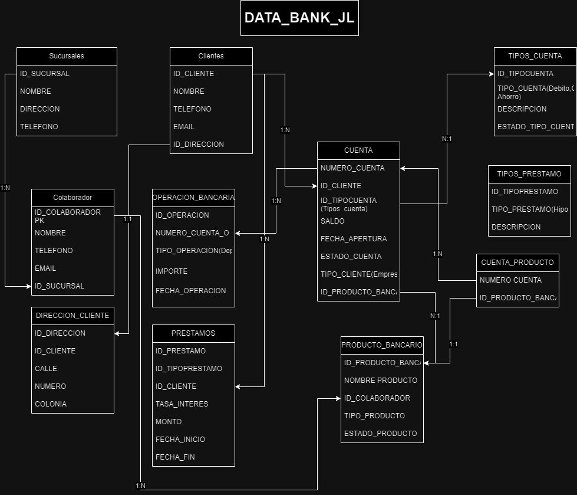

<div style="display: flex; justify-content: space-between; align-items: center;">
    
    
</div>

<p align="center">
  <strong>Materia:</strong> Base de Datos Relacionales <br>
  <strong>Maestra:</strong> Dra.Juanita Hernández López <br>
  <strong>Alumnos:</strong> Jorge Ramon Flores Portilla, Ludan Aguirre Morales <br>
  <strong>Tarea:</strong> II:Diseño del modelo relacional y consultas
</p>


El problema consiste en la creación y administración de diversas tablas para gestionar la información de un banco [DATA_BANK_JL], incluyendo sucursales, clientes, cuentas, productos bancarios, préstamos y demás.

## Esquema relacional


## Creación de Base de Datos
```sql
USE DATA_BANK_JL;

```sql
USE DATA_BANK_JL;

CREATE TABLE SUCURSALES (
    ID_SUCURSAL INT PRIMARY KEY,
    NOMBRE VARCHAR(100) NOT NULL,
    DIRECCION VARCHAR(200) NOT NULL,
    TELEFONO VARCHAR(15)
);

CREATE TABLE TIPOS_CUENTA (
    ID_TIPOCUENTA INT PRIMARY KEY,
    DESCRIPCION VARCHAR(200) NOT NULL,
    TIPO_CUENTA VARCHAR(10) NOT NULL
);

CREATE TABLE TIPOS_PRESTAMO (
    ID_TIPOPRESTAMO INT PRIMARY KEY,
    DESCRIPCION VARCHAR(200) NOT NULL,
    TIPO_PRESTAMO VARCHAR(20) NOT NULL
);

CREATE TABLE DIRECCION_CLIENTE (
    ID_DIRECCION INT PRIMARY KEY,
    ID_CLIENTE INT NOT NULL,
    CALLE VARCHAR(40) NOT NULL,
    NUMERO INT NOT NULL,
    COLONIA VARCHAR(40) NOT NULL
);

CREATE TABLE CLIENTES (
    ID_CLIENTE INT PRIMARY KEY,
    NOMBRE VARCHAR(100) NOT NULL,
    TELEFONO VARCHAR(100) NOT NULL,
    EMAIL VARCHAR(100) NOT NULL,
    ID_DIRECCION INT NOT NULL,
    FOREIGN KEY (ID_DIRECCION) REFERENCES DIRECCION_CLIENTE(ID_DIRECCION)
);

CREATE TABLE COLABORADOR (
    ID_COLABORADOR INT PRIMARY KEY,
    NOMBRE VARCHAR(100) NOT NULL,
    TELEFONO VARCHAR(100) NOT NULL,
    EMAIL VARCHAR(100) NOT NULL,
    ID_SUCURSAL INT NOT NULL,
    FOREIGN KEY (ID_SUCURSAL) REFERENCES SUCURSALES(ID_SUCURSAL)
);

CREATE TABLE PRODUCTO_BANCARIO (
    ID_PRODUCTO_BANCARIO INT PRIMARY KEY,
    NOMBRE_PRODUCTO VARCHAR(200) NOT NULL,
    TIPO_PRODUCTO VARCHAR(50) NOT NULL,
    ESTADO_PRODUCTO VARCHAR(50) NOT NULL,
    ID_COLABORADOR INT NOT NULL,
    FOREIGN KEY (ID_COLABORADOR) REFERENCES COLABORADOR(ID_COLABORADOR),
	CHECK (TIPO_PRODUCTO in ('PRESTAMOS','TRANSACCION')),
	CHECK (ESTADO_PRODUCTO in ('TRUE','FALSE'))
);

CREATE TABLE CUENTA (
    NUMERO_CUENTA INT PRIMARY KEY,
    ID_CLIENTE INT NOT NULL,
    ID_TIPOCUENTA INT NOT NULL,
    ID_PRODUCTO_BANCARIO INT NOT NULL,
    SALDO DECIMAL(15, 2) NOT NULL,
    FECHA_APERTURA DATE NOT NULL,
    TIPO_CLIENTE VARCHAR(50) NOT NULL,
    FOREIGN KEY (ID_CLIENTE) REFERENCES CLIENTES(ID_CLIENTE),
    FOREIGN KEY (ID_TIPOCUENTA) REFERENCES TIPOS_CUENTA(ID_TIPOCUENTA),
    FOREIGN KEY (ID_PRODUCTO_BANCARIO) REFERENCES PRODUCTO_BANCARIO(ID_PRODUCTO_BANCARIO),
	CHECK (TIPO_CLIENTE in ('EMPRESARIAL', 'PERSONAL'))
);

CREATE TABLE PRESTAMOS (
    ID_PRESTAMO INT PRIMARY KEY,
    ID_TIPOPRESTAMO INT NOT NULL,
    ID_CLIENTE INT NOT NULL,
    TASA_INTERES DECIMAL (5,2) NOT NULL,
    MONTO DECIMAL(10,2) NOT NULL,
    FECHA_INICIO DATE,
    FECHA_FIN DATE,
    FOREIGN KEY (ID_CLIENTE) REFERENCES CLIENTES(ID_CLIENTE),
    FOREIGN KEY (ID_TIPOPRESTAMO) REFERENCES TIPOS_PRESTAMO(ID_TIPOPRESTAMO)
);

CREATE TABLE OPERACION_BANCARIA (
    ID_OPERACION INT PRIMARY KEY,
    NUMERO_CUENTA INT NOT NULL,
    TIPO_OPERACION VARCHAR(50) NOT NULL,
    IMPORTE DECIMAL(10,2) NOT NULL,
    FECHA_OPERACION DATETIME,
	CHECK (TIPO_OPERACION in ('DEPOSITO', 'RETIRO','PAGO','TRANSACCION'))
);

CREATE TABLE CUENTA_PRODUCTO (
    NUMERO_CUENTA INT NOT NULL,
    ID_PRODUCTO_BANCARIO INT NOT NULL,
    FOREIGN KEY (NUMERO_CUENTA) REFERENCES CUENTA(NUMERO_CUENTA),
    FOREIGN KEY (ID_PRODUCTO_BANCARIO) REFERENCES PRODUCTO_BANCARIO(ID_PRODUCTO_BANCARIO),
	PRIMARY KEY (NUMERO_CUENTA, ID_PRODUCTO_BANCARIO)
);

```
## Borrado de Datos
```sql

DROP TABLE CUENTA_PRODUCTO;
DROP TABLE CUENTA;
DROP TABLE PRESTAMOS;
DROP TABLE OPERACION_BANCARIA;
DROP TABLE PRODUCTO_BANCARIO;
DROP TABLE COLABORADOR;
DROP TABLE CLIENTES;
DROP TABLE DIRECCION_CLIENTE;
DROP TABLE SUCURSALES;
DROP TABLE TIPOS_CUENTA;
DROP TABLE TIPOS_PRESTAMO;
```
## Actualización de Tablas
```sql
ALTER TABLE CLIENTES
ADD FECHA_NACIMIENTO DATE;

ALTER TABLE dbo.PRESTAMOS
ALTER COLUMN TASA_INTERES NUMERIC(10,2);

ALTER TABLE SUCURSALES
DROP COLUMN TELEFONO;

ALTER TABLE CUENTA
DROP CONSTRAINT CK__CUENTA__TIPO_CLI__571DF1D5;

ALTER TABLE OPERACION_BANCARIA
ADD CONSTRAINT CK_IMPORTE_POSITIVO CHECK (IMPORTE >= 0);

ALTER TABLE CUENTA
ADD CONSTRAINT CK_SALDO_POSITIVO CHECK (SALDO >= 0);

```
## Inserción de datos en Tablas
```sql
```sql
INSERT INTO [dbo].[SUCURSALES] ([ID_SUCURSAL], [NOMBRE], [DIRECCION], [TELEFONO])
VALUES
(1, 'Sucursal Centro', 'Av. Principal 123, Centro', '555-123-4567'),
(2, 'Sucursal Norte', 'Calle Norte 456, Colonia Norte', '555-987-6543'),
(3, 'Sucursal Sur', 'Av. Sur 789, Colonia Sur', '555-567-8901'),
(4, 'Sucursal Oriente', 'Calle Oriente 1011, Colonia Oriente', '555-234-5678'),
(5, 'Sucursal Poniente', 'Av. Poniente 1213, Colonia Poniente', '555-890-1234'),
(6, 'Sucursal Reforma', 'Paseo de la Reforma 1415, Colonia Reforma', '555-345-6789'),
(7, 'Sucursal Insurgentes', 'Av. Insurgentes 1617, Colonia Insurgentes', '555-789-0123'),
(8, 'Sucursal Revolución', 'Calle Revolución 1819, Colonia Revolución', '555-456-7890'),
(9, 'Sucursal Constitución', 'Av. Constitución 2021, Colonia Constitución', '555-012-3456'),
(10, 'Sucursal Juárez', 'Calle Juárez 2223, Colonia Juárez', '555-678-9012'),
(11, 'Sucursal Hidalgo', 'Av. Hidalgo 2425, Colonia Hidalgo', '555-123-4567'),
(12, 'Sucursal Morelos', 'Calle Morelos 2627, Colonia Morelos', '555-987-6543'),
(13, 'Sucursal Allende', 'Av. Allende 2829, Colonia Allende', '555-567-8901'),
(14, 'Sucursal Aldama', 'Calle Aldama 3031, Colonia Aldama', '555-234-5678'),
(15, 'Sucursal Guerrero', 'Av. Guerrero 3233, Colonia Guerrero', '555-890-1234'),
(16, 'Sucursal Abasolo', 'Calle Abasolo 3435, Colonia Abasolo', '555-345-6789'),
(17, 'Sucursal Cuauhtémoc', 'Av. Cuauhtémoc 3637, Colonia Cuauhtémoc', '555-789-0123'),
(18, 'Sucursal Madero', 'Calle Madero 3839, Colonia Madero', '555-456-7890'),
(19, 'Sucursal Zaragoza', 'Av. Zaragoza 4041, Colonia Zaragoza', '555-012-3456'),
(20, 'Sucursal Carranza', 'Calle Carranza 4243, Colonia Carranza', '555-678-9012');


INSERT INTO [dbo].[TIPOS_CUENTA] ([ID_TIPOCUENTA], [DESCRIPCION], [ESTADO_TIPO_CUENTA], [TIPO_CUENTA])
VALUES
(1, 'Cuenta de Ahorro Básica', 'ACTIVO', 'AHORRO'),
(2, 'Cuenta Corriente', 'ACTIVO', 'DEBITO'),
(3, 'Tarjeta de Crédito Clásica', 'ACTIVO', 'CREDITO'),
(4, 'Cuenta de Ahorro Premium', 'ACTIVO', 'AHORRO'),
(5, 'Cuenta de Nómina', 'ACTIVO', 'DEBITO'),
(6, 'Tarjeta de Crédito Gold', 'ACTIVO', 'CREDITO'),
(7, 'Cuenta de Ahorro Infantil', 'INACTIVO', 'AHORRO'),
(8, 'Cuenta Corriente para Jóvenes', 'INACTIVO', 'DEBITO'),
(9, 'Tarjeta de Crédito Platinum', 'ACTIVO', 'CREDITO'),
(10, 'Cuenta de Ahorro para Mayores', 'INACTIVO', 'AHORRO'),
(11, 'Cuenta Corriente con Chequera', 'ACTIVO', 'DEBITO'),
(12, 'Tarjeta de Crédito Black', 'INACTIVO', 'CREDITO'),
(13, 'Cuenta de Ahorro en Dólares', 'ACTIVO', 'AHORRO'),
(14, 'Cuenta Corriente en Euros', 'ACTIVO', 'DEBITO'),
(15, 'Tarjeta de Débito Virtual', 'INACTIVO', 'DEBITO'),
(16, 'Cuenta de Ahorro con Intereses', 'INACTIVO', 'AHORRO'),
(17, 'Cuenta Corriente sin comisiones', 'INACTIVO', 'DEBITO'),
(18, 'Tarjeta de Crédito con cashback', 'INACTIVO', 'CREDITO'),
(19, 'Cuenta de Ahorro para Estudiantes', 'ACTIVO', 'AHORRO'),
(20, 'Cuenta Corriente para Negocios', 'ACTIVO', 'DEBITO');

INSERT INTO [dbo].[TIPOS_PRESTAMO] ([ID_TIPOPRESTAMO], [DESCRIPCION], [TIPO_PRESTAMO])
VALUES 
(1, 'Préstamo Hipotecario a tasa fija', 'HIPOTECARIO'),
(2, 'Préstamo para Automóvil nuevo', 'AUTOMOVILISTICO'),
(3, 'Préstamo Personal para consolidación de deudas', 'BANCARIO'),
(4, 'Préstamo Hipotecario con tasa variable', 'HIPOTECARIO'),
(5, 'Préstamo para Automóvil usado', 'AUTOMOVILISTICO'),
(6, 'Préstamo para mejoras del hogar', 'BANCARIO'),
(7, 'Préstamo Hipotecario para construcción', 'HIPOTECARIO'),
(8, 'Préstamo para compra de motocicleta', 'AUTOMOVILISTICO'),
(9, 'Préstamo para estudios', 'BANCARIO'),
(10, 'Préstamo Hipotecario con garantia hipotecaria', 'HIPOTECARIO'),
(11, 'Préstamo para compra de embarcación', 'AUTOMOVILISTICO'),
(12, 'Préstamo para gastos médicos', 'BANCARIO'),
(13, 'Préstamo Hipotecario para refinanciamiento', 'HIPOTECARIO'),
(14, 'Leasing para vehículo empresarial', 'AUTOMOVILISTICO'),
(15, 'Préstamo para inicio de negocio', 'BANCARIO'),
(16, 'Préstamo Hipotecario para segunda vivienda', 'HIPOTECARIO'),
(17, 'Préstamo para compra de caravana', 'AUTOMOVILISTICO'),
(18, 'Préstamo para viajes', 'BANCARIO'),
(19, 'Préstamo Hipotecario inverso', 'HIPOTECARIO'),
(20, 'Préstamo para compra de vehículo clásico', 'AUTOMOVILISTICO');

INSERT INTO [dbo].[DIRECCION_CLIENTE]
           ([ID_DIRECCION]
           ,[ID_CLIENTE]
           ,[CALLE]
           ,[NUMERO]
           ,[COLONIA])
     VALUES
(1, 11, 'Av. Principal', 1764, 'Colonia Madero'),
(2, 12, 'Calle Carranza', 525, 'Colonia Guerrero'),
(3, 13, 'Av. Guerrero', 1264, 'Colonia Zaragoza'),
(4, 20, 'Av. Constitución', 408, 'Colonia Morelos'),
(5, 19, 'Av. Zaragoza', 1350, 'Colonia Poniente'),
(6, 14, 'Calle Abasolo', 739, 'Colonia Norte'),
(7, 1, 'Calle Revolución', 1358, 'Colonia Hidalgo'),
(8, 2, 'Calle Oriente', 928, 'Colonia Carranza'),
(9, 3, 'Av. Sur', 1787, 'Colonia Revolución'),
(10, 4, 'Av. Insurgentes', 863, 'Colonia Abasolo'),
(11, 5, 'Calle Morelos', 1082, 'Colonia Norte'),
(12, 15, 'Av. Hidalgo', 1813, 'Colonia Poniente'),
(13, 16, 'Calle Aldama', 1502, 'Colonia Hidalgo'),
(14, 17, 'Av. Principal', 1302, 'Colonia Norte'),
(15, 18, 'Calle Revolución', 1616, 'Colonia Revolución'),
(16, 10, 'Calle Norte', 129, 'Colonia Insurgentes'),
(17, 9, 'Av. Zaragoza', 750, 'Colonia Madero'),
(18, 8, 'Paseo de la Reforma', 1251, 'Colonia Juárez'),
(19, 7, 'Av. Sur', 1883, 'Centro'),
(20, 6, 'Calle Aldama', 1406, 'Colonia Carranza');

INSERT INTO [dbo].[CLIENTES]
           ([ID_CLIENTE]
           ,[NOMBRE]
           ,[TELEFONO]
           ,[EMAIL]
           ,[ID_DIRECCION])
     VALUES
(1, 'Juan Pérez', '555-1234', 'juan.perez@example.com', 11),
(2, 'María García', '555-5678', 'maria.garcia@example.com',12),
(3, 'Pedro Rodríguez', '555-9012', 'pedro.rodriguez@example.com', 13),
(4, 'Ana López', '555-3456', 'ana.lopez@example.com', 14),
(5, 'Luis Martínez', '555-7890', 'luis.martinez@example.com', 15),
(6, 'Sofía Hernández', '555-2345', 'sofia.hernandez@example.com', 20),
(7, 'Carlos González', '555-6789', 'carlos.gonzalez@example.com', 10),
(8, 'Laura Díaz', '555-0123', 'laura.diaz@example.com', 9),
(9, 'Jorge Sánchez', '555-4567', 'jorge.sanchez@example.com', 8),
(10, 'Isabel Ramírez', '555-8901', 'isabel.ramirez@example.com', 7),
(11, 'Fernando Torres', '555-3456', 'fernando.torres@example.com', 6),
(12, 'Marta Flores', '555-7890', 'marta.flores@example.com', 1),
(13, 'Miguel Vargas', '555-2345', 'miguel.vargas@example.com', 2),
(14, 'Carmen Reyes', '555-6789', 'carmen.reyes@example.com', 3),
(15, 'Javier Ortega', '555-0123', 'javier.ortega@example.com', 4),
(16, 'Raquel Morales', '555-4567', 'raquel.morales@example.com', 5),
(17, 'David Romero', '555-8901', 'david.romero@example.com', 16),
(18, 'Rosa Moreno', '555-3456', 'rosa.moreno@example.com', 17),
(19, 'Alberto Méndez', '555-7890', 'alberto.mendez@example.com', 18),
(20, 'Yolanda Domínguez', '555-2345', 'yolanda.dominguez@example.com', 19);

INSERT INTO [dbo].[COLABORADOR]
           ([ID_COLABORADOR]
           ,[NOMBRE]
           ,[TELEFONO]
           ,[EMAIL]
           ,[ID_SUCURSAL])
     VALUES
(1, 'Ana García', '555-1234', 'ana.garcia@example.com', 11),
(2, 'Luis Rodríguez', '555-5678', 'luis.rodriguez@example.com', 13),
(3, 'Sofía Martínez', '555-9012', 'sofia.martinez@example.com', 6),
(4, 'Carlos López', '555-3456', 'carlos.lopez@example.com', 5),
(5, 'Laura Hernández', '555-7890', 'laura.hernandez@example.com', 8),
(6, 'Jorge González', '555-2345', 'jorge.gonzalez@example.com', 20),
(7, 'Isabel Díaz', '555-6789', 'isabel.diaz@example.com', 12),
(8, 'Fernando Sánchez', '555-0123', 'fernando.sanchez@example.com', 19),
(9, 'Marta Ramírez', '555-4567', 'marta.ramirez@example.com', 7),
(10, 'Miguel Torres', '555-8901', 'miguel.torres@example.com', 17),
(11, 'Carmen Flores', '555-3456', 'carmen.flores@example.com', 18),
(12, 'Javier Vargas', '555-7890', 'javier.vargas@example.com', 14),
(13, 'Raquel Ortega', '555-2345', 'raquel.ortega@example.com', 2),
(14, 'David Morales', '555-6789', 'david.morales@example.com', 10),
(15, 'Rosa Romero', '555-0123', 'rosa.romero@example.com', 16),
(16, 'Alberto Moreno', '555-4567', 'alberto.moreno@example.com', 9),
(17, 'Yolanda Méndez', '555-8901', 'yolanda.mendez@example.com', 4),
(18, 'Juan Domínguez', '555-3456', 'juan.dominguez@example.com', 15),
(19, 'María Pérez', '555-7890', 'maria.perez@example.com', 1),
(20, 'Pedro García', '555-2345', 'pedro.garcia@example.com', 3);

INSERT INTO [dbo].[PRODUCTO_BANCARIO]
           ([ID_PRODUCTO_BANCARIO]
           ,[NOMBRE_PRODUCTO]
           ,[TIPO_PRODUCTO]
           ,[ESTADO_PRODUCTO]
           ,[ID_COLABORADOR])
     VALUES
(1, 'Préstamo Personal', 'PRESTAMOS', 'TRUE', 3),
(2, 'Tarjeta de Crédito Clásica', 'PRESTAMOS', 'TRUE', 1),
(3, 'Cuenta de Ahorro', 'TRANSACCION', 'TRUE', 15),
(4, 'Préstamo Hipotecario', 'PRESTAMOS', 'TRUE', 4),
(5, 'Transferencias Internacionales', 'TRANSACCION', 'TRUE', 9),
(6, 'Préstamo para Vehículo', 'PRESTAMOS', 'TRUE', 16),
(7, 'Pagos de Servicios', 'TRANSACCION', 'TRUE', 10),
(8, 'Préstamo para Estudios', 'PRESTAMOS', 'TRUE', 2),
(9, 'Inversiones en Fondos Mutuos', 'TRANSACCION', 'FALSE', 14),
(10, 'Préstamo para Consolidación de Deudas', 'PRESTAMOS', 'TRUE', 18),
(11, 'Compra de Divisas', 'TRANSACCION', 'TRUE', 17),
(12, 'Préstamo para Negocios', 'PRESTAMOS', 'TRUE', 7),
(13, 'Seguros de Vida', 'TRANSACCION', 'TRUE', 19),
(14, 'Préstamo para Vivienda', 'PRESTAMOS', 'FALSE', 12),
(15, 'Giros Nacionales', 'TRANSACCION', 'TRUE', 20),
(16, 'Tarjeta de Débito', 'TRANSACCION', 'TRUE', 8),
(17, 'Préstamo para Remodelación', 'PRESTAMOS', 'FALSE', 5),
(18, 'Apertura de Cuenta Corriente', 'TRANSACCION', 'TRUE', 6),
(19, 'Préstamo para Electrodomésticos', 'PRESTAMOS', 'TRUE', 13),
(20, 'Depósitos a Plazo Fijo', 'TRANSACCION', 'TRUE', 11);

INSERT INTO [dbo].[CUENTA]
([NUMERO_CUENTA], [ID_CLIENTE], [ID_TIPOCUENTA], [ID_PRODUCTO_BANCARIO], [SALDO], [FECHA_APERTURA], [TIPO_CLIENTE])
VALUES
(1235, 19, 17, 4, 235401.59, '2021-04-12', 'PERSONAL'),
(1271, 17, 8, 4, 180357.39, '2023-01-13', 'EMPRESARIAL'),
(1736, 6, 19, 7, 189959.74, '2023-09-13', 'EMPRESARIAL'),
(2057, 12, 10, 14, 433886.89, '2021-11-19', 'PERSONAL'),
(2673, 12, 2, 6, 137536.18, '2023-07-12', 'EMPRESARIAL'),
(2737, 6, 15, 3, 487307.9, '2023-01-16', 'EMPRESARIAL'),
(1329, 14, 18, 1, 187934.75, '2022-09-08', 'PERSONAL'),
(1869, 18, 1, 13, 61532.83, '2023-04-30', 'PERSONAL'),
(2507, 19, 5, 19, 115855.94, '2022-08-23', 'PERSONAL'),
(2233, 12, 2, 10, 66767.71, '2022-04-29', 'PERSONAL'),
(2423, 13, 13, 15, 228982.38, '2022-11-18', 'PERSONAL'),
(2250, 5, 15, 11, 416408.82, '2020-05-26', 'EMPRESARIAL'),
(1497, 15, 11, 2, 22160.86, '2022-07-05', 'PERSONAL'),
(2449, 15, 7, 8, 95890.84, '2021-08-24', 'PERSONAL'),
(2306, 10, 10, 7, 104999.31, '2023-04-21', 'EMPRESARIAL'),
(1952, 6, 20, 10, 36928.36, '2022-08-01', 'PERSONAL'),
(1120, 12, 12, 17, 343154.8, '2020-11-08', 'PERSONAL'),
(2910, 19, 2, 16, 231507.27, '2021-05-12', 'EMPRESARIAL'),
(2039, 13, 7, 18, 433194.59, '2023-06-12', 'PERSONAL'),
(2808, 3, 20, 11, 496777.46, '2023-12-24', 'PERSONAL');

INSERT INTO [dbo].[PRESTAMOS]
           ([ID_PRESTAMO]
           ,[ID_TIPOPRESTAMO]
           ,[ID_CLIENTE]
           ,[TASA_INTERES]
           ,[MONTO]
           ,[FECHA_INICIO]
           ,[FECHA_FIN])
     VALUES
(1,  6,  8,  8.62, 166820.91, '2023-09-06', '2027-02-14'),
(2,  3, 10, 42.00, 451971.96, '2020-10-20', '2030-02-20'),
(3,  1, 10, 28.25, 431354.89, '2023-03-30', '2028-10-26'),
(4, 18,  3, 10.14,  28230.39, '2021-01-05', '2026-01-25'),
(5, 17, 14, 47.57, 394968.64, '2020-03-07', '2021-10-31'),
(6, 12,  2,  4.56, 175169.52, '2021-01-22', '2024-01-22'),
(7, 16, 18, 46.65, 320420.74, '2022-01-24', '2025-05-10'),
(8,  8, 14, 19.57, 147261.48, '2022-10-08', '2031-08-11'),
(9,  8, 15, 41.35, 480952.85, '2023-02-15', '2025-08-20'),
(10, 19, 11, 28.88, 146929.00, '2020-03-04', '2027-03-21'),
(11,  1,  1, 47.82, 307871.98, '2020-01-13', '2021-01-07'),
(12,  4,  9, 23.58, 374376.33, '2020-12-09', '2029-04-08'),
(13, 12,  4,  7.24, 279789.81, '2022-08-27', '2024-02-25'),
(14, 13,  9, 10.10, 405595.11, '2022-11-24', '2031-07-10'),
(15, 12,  1, 23.08, 459900.49, '2021-10-07', '2025-09-23'),
(16,  2, 17, 17.41,  32117.80, '2022-09-18', '2023-07-16'),
(17,  4, 15, 36.55, 365185.80, '2023-07-22', '2026-02-11'),
(18,  8,  7, 25.55, 183948.62, '2023-02-09', '2024-11-06'),
(19,  5, 16, 41.42, 448007.08, '2020-05-01', '2023-09-03'),
(20, 14, 11,  4.80, 347324.59, '2021-11-29', '2028-10-28');

INSERT INTO [dbo].[OPERACION_BANCARIA]
           ([ID_OPERACION]
           ,[NUMERO_CUENTA]
           ,[TIPO_OPERACION]
           ,[IMPORTE]
           ,[FECHA_OPERACION])
     VALUES
(745, 2673, 'TRANSACCION', 6443.0, '2023-08-04 00:00:00'),
(512, 1952, 'PAGO', 1199.82, '2023-05-26 00:00:00'),
(60, 1235, 'DEPOSITO', 2674.33, '2023-10-17 00:00:00'),
(667, 2673, 'TRANSACCION', 139.65, '2023-06-02 00:00:00'),
(276, 2910, 'DEPOSITO', 287.29, '2023-05-31 00:00:00'),
(409, 2233, 'TRANSACCION', 2360.96, '2023-03-05 00:00:00'),
(994, 1869, 'RETIRO', 623.97, '2023-12-21 00:00:00'),
(292, 1869, 'RETIRO', 8822.86, '2023-02-22 00:00:00'),
(462, 2306, 'PAGO', 1750.87, '2023-09-19 00:00:00'),
(106, 2910, 'TRANSACCION', 1284.08, '2023-10-21 00:00:00'),
(57, 1952, 'PAGO', 6785.48, '2023-03-09 00:00:00'),
(607, 2039, 'DEPOSITO', 574.25, '2023-11-08 00:00:00'),
(407, 2808, 'RETIRO', 3997.5, '2023-06-25 00:00:00'),
(150, 2423, 'TRANSACCION', 4971.59, '2023-07-13 00:00:00'),
(9, 2423, 'RETIRO', 6299.32, '2023-04-21 00:00:00'),
(974, 2449, 'TRANSACCION', 3277.99, '2023-09-13 00:00:00'),
(682, 1497, 'DEPOSITO', 4198.08, '2023-08-10 00:00:00'),
(42, 2039, 'TRANSACCION', 739.9, '2023-07-11 00:00:00'),
(810, 2306, 'DEPOSITO', 8153.33, '2023-07-28 00:00:00'),
(125, 1952, 'DEPOSITO', 5333.53, '2023-04-10 00:00:00');

INSERT INTO CUENTA_PRODUCTO (NUMERO_CUENTA, ID_PRODUCTO_BANCARIO) VALUES
(2673, 7),
(2039, 15),
(1329, 13),
(1235, 11),
(1271, 9),
(1120, 14),
(2057, 4),
(2423, 17),
(2507, 16),
(1869, 19),
(1497, 1),
(1497, 3),
(2737, 7),
(2233, 12),
(2910, 2),
(1952, 17),
(1497, 13),
(1120, 4),
(1736, 6),
(2039, 11);

```
## Borrado de datos en Tablas
```sql

DELETE FROM [dbo].[SUCURSALES]
    WHERE NOMBRE='Sucursal Guerrero';

DELETE FROM [dbo].[TIPOS_CUENTA]
    WHERE ID_TIPOCUENTA = 10;

DELETE FROM [dbo].[TIPOS_PRESTAMO]
    WHERE ID =19;

DELETE FROM [dbo].[CLIENTES]
    WHERE ID_CLIENTE = 16;


DELETE FROM PRODUCTO_BANCARIO WHERE ID_PRODUCTO_BANCARIO = 10;


DELETE FROM CUENTA WHERE NUMERO_CUENTA = 1235;


DELETE FROM CLIENTES WHERE ID_CLIENTE = 5;


DELETE FROM PRESTAMOS WHERE TASA_INTERES > 0.30;

DELETE FROM OPERACION_BANCARIA WHERE TIPO_OPERACION = 'DEPOSITO' AND IMPORTE < 1000.00;

```
## Actualización de datos en tablas
```sql
UPDATE SUCURSALES SET NOMBRE = 'Sucursal Centro Histórico' WHERE ID_SUCURSAL = 1;

UPDATE SUCURSALES SET DIRECCION = 'Av. Occidental 1213, Col. Poniente', TELEFONO = '555-890-5555' WHERE ID_SUCURSAL = 5;

UPDATE TIPOS_CUENTA SET ESTADO_TIPO_CUENTA = 'INACTIVO' WHERE ID_TIPOCUENTA = 3;

UPDATE TIPOS_PRESTAMO SET DESCRIPCION = 'Préstamo con Garantáa Hipotecaria' WHERE ID_TIPOPRESTAMO = 10;

UPDATE DIRECCION_CLIENTE SET CALLE = 'Calle Nueva', NUMERO = 155 WHERE ID_CLIENTE = 15;

UPDATE CLIENTES SET EMAIL = 'carlos.gonzalez.new@example.com' WHERE ID_CLIENTE = 7;

UPDATE COLABORADOR SET TELEFONO = '555-123-7890' WHERE ID_COLABORADOR = 12;


UPDATE PRODUCTO_BANCARIO SET ESTADO_PRODUCTO = 'TRUE' WHERE ID_PRODUCTO_BANCARIO = 14;

UPDATE CUENTA SET SALDO = 500000.00 WHERE NUMERO_CUENTA = 2057;


UPDATE PRESTAMOS SET TASA_INTERES = 5.50 WHERE ID_PRESTAMO = 8;

```
## Aplicación de consultas y sentencias
```sql
--1
SELECT NOMBRE, TELEFONO
FROM CLIENTES
WHERE EMAIL LIKE '%example.com';

--2
SELECT C.NOMBRE, CU.SALDO
FROM CLIENTES C
JOIN CUENTA CU ON C.ID_CLIENTE = CU.ID_CLIENTE
WHERE CU.SALDO > 100000;

--3
SELECT TOP 5 CL.NOMBRE, CU.SALDO
FROM CUENTA CU
JOIN CLIENTES CL ON CU.ID_CLIENTE = CL.ID_CLIENTE
ORDER BY CU.SALDO DESC;

--4
SELECT C.NOMBRE, PR.MONTO
FROM CLIENTES C
JOIN PRESTAMOS PR ON C.ID_CLIENTE = PR.ID_CLIENTE
WHERE PR.MONTO > 200000
ORDER BY PR.MONTO DESC;

--5

SELECT TC.TIPO_CUENTA, COUNT(CU.NUMERO_CUENTA) AS TOTAL_CUENTAS
FROM CUENTA CU
JOIN TIPOS_CUENTA TC ON CU.ID_TIPOCUENTA = TC.ID_TIPOCUENTA
GROUP BY TC.TIPO_CUENTA
HAVING COUNT(CU.NUMERO_CUENTA) > 5;

--6
SELECT CL.NOMBRE, CO.NOMBRE AS NOMBRE_COLABORADOR
FROM CLIENTES CL
JOIN CUENTA CU ON CL.ID_CLIENTE = CU.ID_CLIENTE
JOIN PRODUCTO_BANCARIO PB ON CU.ID_PRODUCTO_BANCARIO = PB.ID_PRODUCTO_BANCARIO
JOIN COLABORADOR CO ON PB.ID_COLABORADOR = CO.ID_COLABORADOR
WHERE PB.TIPO_PRODUCTO = 'PRESTAMOS';

--7
SELECT DISTINCT TIPO_OPERACION
FROM OPERACION_BANCARIA
ORDER BY TIPO_OPERACION;

--8
WITH CTE_SaldosAltos AS (
    SELECT ID_CLIENTE, SALDO
    FROM CUENTA
    WHERE SALDO > 200000
)
SELECT C.NOMBRE, S.SALDO
FROM CLIENTES C
JOIN CTE_SaldosAltos S ON C.ID_CLIENTE = S.ID_CLIENTE;

--9
WITH CTE_MultipleAccounts AS (
    SELECT ID_CLIENTE, COUNT(NUMERO_CUENTA) AS TOTAL_CUENTAS
    FROM CUENTA
    GROUP BY ID_CLIENTE
    HAVING COUNT(NUMERO_CUENTA) > 1
)
SELECT C.NOMBRE, MA.TOTAL_CUENTAS
FROM CLIENTES C
JOIN CTE_MultipleAccounts MA ON C.ID_CLIENTE = MA.ID_CLIENTE
ORDER BY MA.TOTAL_CUENTAS DESC;

--10
SELECT TOP 5 C.NOMBRE, CU.SALDO
FROM CLIENTES C
JOIN CUENTA CU ON C.ID_CLIENTE = CU.ID_CLIENTE
ORDER BY CU.SALDO DESC;

--11
SELECT CU.NUMERO_CUENTA, C.NOMBRE AS Cliente, OB.TIPO_OPERACION, OB.IMPORTE
FROM OPERACION_BANCARIA OB
JOIN CUENTA CU ON OB.NUMERO_CUENTA = CU.NUMERO_CUENTA
JOIN CLIENTES C ON CU.ID_CLIENTE = C.ID_CLIENTE
WHERE OB.IMPORTE > 5000
ORDER BY OB.IMPORTE DESC;

--12
SELECT C.NOMBRE AS Cliente, SUM(P.MONTO) AS MontoTotalPrestamo
FROM CLIENTES C
JOIN PRESTAMOS P ON C.ID_CLIENTE = P.ID_CLIENTE
JOIN TIPOS_PRESTAMO TP ON P.ID_TIPOPRESTAMO = TP.ID_TIPOPRESTAMO
WHERE TP.TIPO_PRESTAMO = 'AUTOMOVILISTICO'
GROUP BY C.NOMBRE;

--13
SELECT TP.DESCRIPCION AS TipoPrestamo, AVG(P.MONTO) AS PromedioMonto
FROM PRESTAMOS P
JOIN TIPOS_PRESTAMO TP ON P.ID_TIPOPRESTAMO = TP.ID_TIPOPRESTAMO
GROUP BY TP.DESCRIPCION;

--14
SELECT TOP 5 C.NOMBRE AS Cliente, CU.SALDO
FROM CLIENTES C
JOIN CUENTA CU ON C.ID_CLIENTE = CU.ID_CLIENTE
ORDER BY CU.SALDO DESC;

--15
SELECT C.NOMBRE AS Cliente
FROM CLIENTES C
WHERE EXISTS (SELECT 1 FROM PRESTAMOS P WHERE P.ID_CLIENTE = C.ID_CLIENTE)
  AND EXISTS (SELECT 1 FROM CUENTA CU WHERE CU.ID_CLIENTE = C.ID_CLIENTE AND CU.SALDO > 10000);

--16
SELECT OB.ID_OPERACION, OB.NUMERO_CUENTA, OB.TIPO_OPERACION, OB.IMPORTE, OB.FECHA_OPERACION
FROM OPERACION_BANCARIA OB
WHERE OB.FECHA_OPERACION >= DATEADD(month, -36, GETDATE());

--17
SELECT C.NOMBRE AS Cliente, T.DESCRIPCION AS TipoCuenta, CU.SALDO
FROM CLIENTES C
JOIN CUENTA CU ON C.ID_CLIENTE = CU.ID_CLIENTE
JOIN TIPOS_CUENTA T ON CU.ID_TIPOCUENTA = T.ID_TIPOCUENTA
WHERE T.TIPO_CUENTA = 'AHORRO';

--18
SELECT S.NOMBRE, CO.NOMBRE AS Colaborador, P.NOMBRE_PRODUCTO AS Producto
FROM COLABORADOR CO
JOIN SUCURSALES S ON CO.ID_SUCURSAL = S.ID_SUCURSAL
JOIN PRODUCTO_BANCARIO P ON CO.ID_COLABORADOR = P.ID_COLABORADOR
WHERE S.NOMBRE like '%Sucursal%';

```
## Explicación de la participación que tuvo cada integrante del equipo:
Como equipo avanzamos de la siguiente manera:
1) Abstraer el problema del banco, sus atributos y caracteristicas.
2) Aplicar los conocimientos anteriores en un diagrama de flujo, que representaria las conexiones entre los atributos existentes.
3) Creación de tablas para definir atributos,primary key y foregin key.
4) Aplicación de los puntos anteriores a nivel SQL Server, esto es: Creación, actualización, borrado de nuestras tablas. Ademas de poblarlas con datos que tuviesen sentido de acuerdo a los atributos.

Lo anterior fue totalmente en equipo, para agilizar y comprobar dichos resultados, organizamos meets. La finalidad fue aprender, mejorar y entender todos los procesos que nos llevaria a cumplir nuestro objetivo. Cabe mencionar, que pensamos en áreas de mejora que iremos implementado a lo largo del curso para llegar a una base de datos mas sólida.

