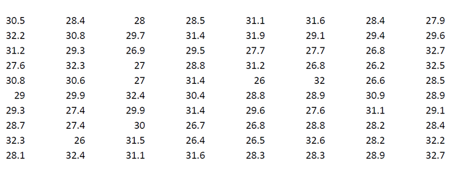
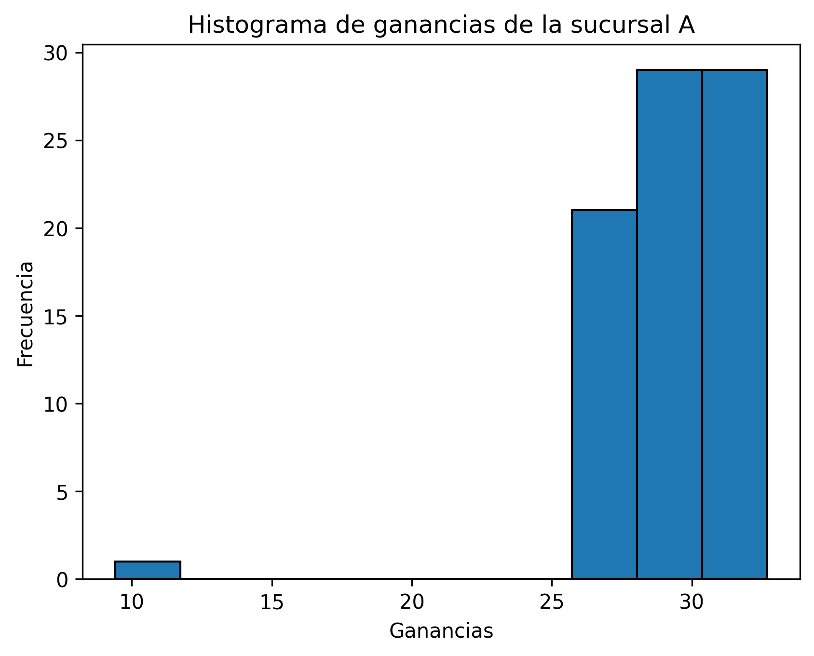

## Problema 2

### a) Características: Indique el tipo de variable, el tamaño de la muestra

- **Tipo de variable**: Como los valores representan cantidades numéricas y pueden tomar cualquier valor dentro de un rango continuo, entonces la variable es cuantitativa continua.
- **Tamaño de muestra**: 60 registros.

### b) Medidas descriptivas: Calcule el valor del rango, media, mínimo, máximo, varianza, coeficiente de variación.

- **Valor del rango**: 23.3
- **Media**: 29.15375
- **Mínimo**: 9.4
- **Máximo**: 32.7
- **Varianza**: 8.79872
- **Coeficiente de variación**: 10.174553

### c) Métodos gráficos: Realice el histograma correspondiente y comente sobre la simetría de la distribución de los datos

- El histograma muestra la distribución de los datos, siendo asimetrica hacia la derecha. Observando que la mayor concentración de los datos esta entre $25<x≤30+k_1$ con $k_1$ constante.  Asi mismo se observa un valor atipico aproximadamente en $x=10$. Podemos concluir que el histograma de las ganancias de la sucursal $A$ muestra una distribución asimétrica hacia la derecha. La mayoria de los registros de ganancias caen en el intervalo $25<x≤30+k_1$ con $k_1$ constante. Observando un valor atipico ya mencionado en $x=10$