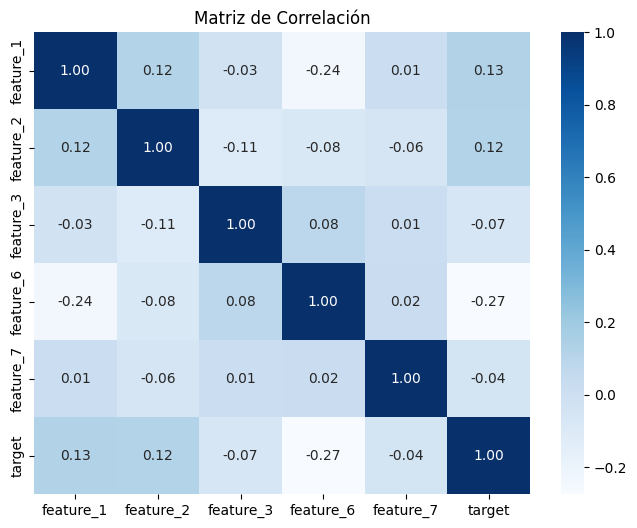

# Hallazgos del Análisis y Modelo de Clasificación

## Exploración Inicial del Dataset
- Se identificaron las siguientes características en el conjunto de datos:
  - Variables predictoras: `feature_1`, `feature_2`, `feature_3`, `feature_6`, `feature_7`
  - Variable objetivo: `target` (clasificación binaria 0/1).
  - Se descartaron las columnas `Id`, `feature_4`, `feature_5`, `feature_8` por indicaciones previas.

- Se eliminaron valores nulos y filas duplicadas para mejorar la calidad de los datos.

## Matriz de Correlación
- Se calculó la correlación entre las características y la variable objetivo (`target`).
- Hallazgos clave:
  - `feature_6` tiene la correlación más alta con `target` (-0.27), indicando que puede ser una característica relevante para el modelo.
  - `feature_1` y `feature_2` también muestran correlaciones positivas débiles con `target` (0.12 - 0.13).
  - `feature_3` y `feature_7` tienen una correlación cercana a 0 con `target`, lo que sugiere que podrían tener poca influencia en la predicción.

## Entrenamiento del Modelo
- Se utilizó Random Forest como clasificador con `n_estimators=100`.
- División del dataset:
  - 80% datos de entrenamiento
  - 20% datos de prueba

## Resultados del Modelo
- Accuracy general: 60.03%
- Matriz de Confusión:

- El modelo clasifica mejor la clase 1, pero tiene dificultades con la clase 0.

- Reporte de Clasificación:
- Clase 0
  - Precisión: 53.66%
  - Recall: 41.31%
  - F1-score: 46.68%

- Clase 1
  - Precisión: 63.13%
  - Recall: 73.79%
  - F1-score: 68.04%

- Promedio Ponderado
  - Precisión: 59.11%
  - Recall: 60.03%
  - F1-score: 58.99%

## Conclusiones y Mejoras Posibles
1. El modelo tiene un desempeño moderado, pero no logra capturar correctamente la clase 0.
2. Mejoras sugeridas:
 - Balancear las clases usando SMOTE o reponderación.
 - Probar otros clasificadores como XGBoost o Regresión Logística.
 - Optimización de hiperparámetros en el Random Forest (`max_depth`, `min_samples_split`).
 - Selección de características para eliminar variables menos relevantes.
 - Inclusión de nuevas variables que están disponibles en el conjunto de datos

 Link del código: https://colab.research.google.com/drive/1-8IRR1kkZ1AH1r3XoTXkgfqfx9b6vHqf?usp=sharing
