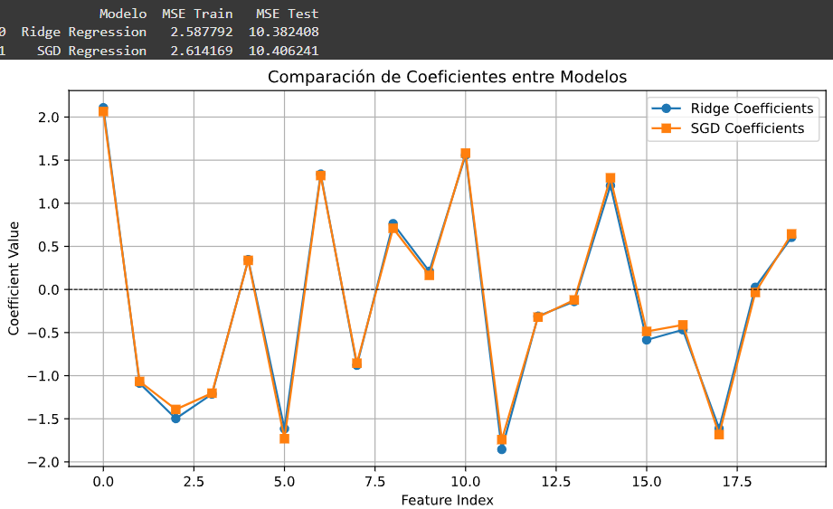
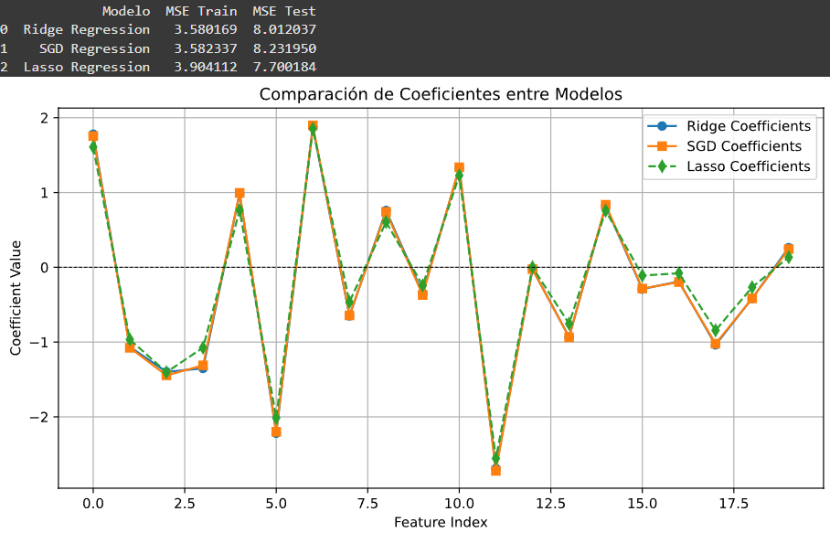

## Comparación de Regresiones: Ridge vs. SGD

### 1. Resultados de MSE
| Modelo              | MSE Train | MSE Test |
|---------------------|----------|----------|
| Ridge Regression   | 2.58     | 10.38    |
| SGD Regression     | 2.61     | 10.40    |

- **Conclusión:** Ridge Regression tiene un MSE de prueba ligeramente menor, lo que sugiere que generaliza un poco mejor que SGD.

---
## 2. Análisis de Coeficientes
- Los coeficientes de Ridge y SGD son muy similares en la mayoría de las características.
- Parece que Ridge es más estable, mientras que SGD introduce más variabilidad en algunos coeficientes.
- La diferencia en coeficientes puede deberse a la naturaleza del optimizador SGD, que puede ser más sensible a la escala de los datos.

---

## 3. Conclusión:
- Tal vez se deba explorar diferentes valores de \(\alpha\)** para optimizar la regularización.
- Normalizar los datos antes de entrenar el modelo con SGD para mejorar estabilidad.
- Probar Lasso Regression para evaluar si algunos coeficientes pueden ser eliminados.
- Realizar validación cruzada para comprobar la estabilidad de los modelos.

## Incluyendo Lasso Regression

### Comparación de Modelos de Regresión: Ridge, Lasso y SGD

### 1. Comparación de MSE (Error Cuadrático Medio)

| Modelo             | MSE Train | MSE Test |
|-------------------|----------|----------|
| Ridge Regression | **3.58**  | **8.01**  |
| SGD Regression   | **3.58**  | **8.23**  |
| Lasso Regression | **3.90**  | **7.70**  |

### Análisis:
- Lasso Regression tiene el menor error en prueba (7.70), lo que sugiere que mejora la generalización eliminando características irrelevantes.
- Ridge y SGD tienen MSE similares en entrenamiento (3.58), pero Ridge es ligeramente mejor en prueba (8.01 vs. 8.23).
- SGD Regression tiene un rendimiento muy similar a Ridge, pero puede ser más inestable dependiendo del dataset.

---

### 2. Comparación de Coeficientes

### Observaciones:
- Los coeficientes de Ridge y SGD son casi idénticos, lo que indica que ambos métodos imponen una penalización similar a los pesos.
- Lasso elimina algunas variables (coeficientes en 0), lo que sugiere que puede mejorar interpretabilidad reduciendo la dimensionalidad del modelo.
- SGD introduce más variabilidad en los coeficientes, ya que es un método basado en optimización iterativa.

### Conclusión final:
- Lasso es útil cuando se necesita una selección de características automática, ya que impone coeficientes en 0 y descarta variables irrelevantes.
- Ridge es mejor cuando todas las características son importantes, ya que distribuye los pesos sin eliminarlos completamente.
- SGD es útil para datasets grandes, pero puede ser más inestable que Ridge.

Parece ser que si el objetivo es la mejor precisión en test, Lasso es la mejor opción en este experimento.
Si todas las variables son relevantes y queremos estabilidad en los coeficientes, Ridge es la mejor opción Mientras que si el dataset es grande y queremos eficiencia computacional, SGD puede ser útil, aunque puede introducir más variabilidad.

Link del código: https://colab.research.google.com/drive/1Dg6saUMEnCfKIiUtBHDxM-jXE9ayLJtJ?usp=sharing