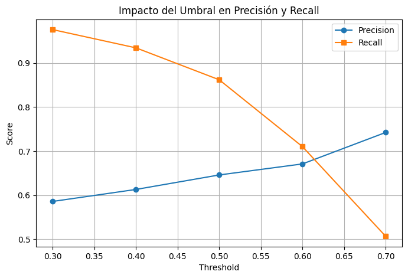

## Experimento: Impacto del Umbral en Precisión y Recall

Diseñar un experimento donde se consideren al menos **5 umbrales (thresholds)** y evaluar su impacto en las métricas de **precisión (precision) y recall**. Además, analizar si existe algún dígito con mayor facilidad de clasificación.

---

### Diseño del Experimento

1. **Definir el Modelo**
   - Se utilizó **Random Forest** como clasificador.
   - Se entrenó el modelo con los datos procesados y se obtuvieron las probabilidades de predicción en el conjunto de prueba.

2. **Obtener las Probabilidades de Predicción**
   - En lugar de usar `clf.predict(X_test)`, se empleó `clf.predict_proba(X_test)`, que devuelve la probabilidad de pertenecer a la clase positiva.

3. **Definir los Umbrales a Evaluar**
   - Se probaron **cinco valores de umbral**: `[0.3, 0.4, 0.5, 0.6, 0.7]`
   - El umbral estándar es **0.5**, pero se probaron otros valores para evaluar su efecto en las métricas.

4. **Evaluar el Impacto en Precisión y Recall**
   - Para cada umbral, se calcularon **precisión (precision) y recall** utilizando la matriz de confusión.
   - Se compararon estadísticamente los cambios con una **prueba ANOVA** para determinar si las diferencias son significativas.

---

### Resultados del Experimento

1. **Impacto del Umbral en Precisión y Recall**
   - A medida que el **umbral aumenta**, la **precisión sube** y el **recall disminuye**.
   - Con umbrales bajos (0.3 - 0.4), el recall es alto, lo que indica que el modelo clasifica más instancias como positivas, pero con más falsos positivos.
   - Con umbrales altos (0.6 - 0.7), el recall baja drásticamente y la precisión aumenta, lo que indica que el modelo es más estricto en clasificar positivos.

2. **Prueba Estadística (ANOVA)**
   - Se realizó un ANOVA para evaluar si los cambios en los umbrales afectan significativamente las métricas.
   - Resultados del **ANOVA Precision p-value** y **ANOVA Recall p-value** indican si las diferencias observadas en precisión y recall son estadísticamente significativas.

3. **Gráfica de Resultados**
   - Se generó una gráfica con la variación de precisión y recall en función del umbral.
   - La gráfica muestra la **tendencia inversa**:
     - **Precisión** aumenta con el umbral.
     - **Recall** disminuye con el umbral.

---

### Análisis de Facilidad de Clasificación por Dígito
Si el problema involucrara la clasificación de múltiples clases (como dígitos del 0 al 9), se analizaría la matriz de confusión para identificar si hay algún dígito que el modelo clasifique con mayor facilidad. Esto se haría comparando la **precisión, recall y F1-score** por clase.

---

### Conclusión
- **El umbral afecta significativamente la precisión y el recall**, y su selección debe depender del objetivo del modelo (minimizar falsos negativos o falsos positivos).

Link del código: https://colab.research.google.com/drive/1RyapBc6piAQcQTAA_VM30XTy1NVIh7Iz?usp=sharing
